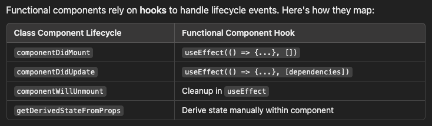

# Virtual DOM (VDOM)

- The Virtual DOM (VDOM) is a lightweight, in-memory representation of the real DOM (Document Object Model)

- In React, it acts as an intermediary between the application and the real DOM to optimize performance.

- In React, there is one shared Virtual DOM for the entire app, not independent Virtual DOMs for each component. However, each component can have its own part of the Virtual DOM tree, but it ultimately all merges into a single, unified Virtual DOM for the entire React application.

- When a component re-renders in React, the entire component's virtual DOM (vDOM) is recreated. Note that vDOM for only that compoent is re-created which has been re-rendered.

  

## vDOM Node

Each element in your React component tree corresponds to a vDOM node. This node holds information about:

1. **Type**: The type of element (e.g., 'div', 'span', 'button')
2. **Props**: Attributes and properties of the element (e.g., className, onClick, style)
3. **Children**: Child vDOM nodes (if any)

## Re-rendering the Component vs. Rebuilding the Entire vDOM

1. **Entire Component’s vDOM Gets Recreated not just just one or two JSX elements within the component where the changes has been made**:

   - React doesn't rebuild the virtual DOM only for the changed part. Instead, it re-renders the entire component because the component’s render function is executed again.
   - This is an inherent part of React's declarative approach. The render function describes what the UI should look like given the current state and props. When the state or props change, React calls the render function again to determine what the updated UI should look like.
   - Take the example, As part of this re-render, React creates a new virtual DOM representation for the entire component, including all the JSX elements (`<h1>, 
, 
`, etc.) inside it.

2. **Diffing/Reconciliation**

   - After the component's new virtual DOM is created, React compares it with the old virtual DOM for that component. This is where the diffing process comes into play.
   - The diffing algorithm does not update every single element. Instead, it checks each virtual DOM node in the new vDOM against the corresponding node in the old vDOM. React then:
     1. Detects if something has changed (like the text inside an `<h1>` tag).
     2. Updates only the changed part of the actual DOM (e.g., the content of the `<h1>`).
     3. If there’s no change (e.g., if the `
` or `
` haven’t changed), React doesn’t update the real DOM for those nodes.

3. When a React component re-renders, the old vDOM is replaced by the new vDOM after the diffing process is complete.

   1. The new virtual DOM replaces the old virtual DOM in React's internal memory.
   2. React uses this updated virtual DOM as the baseline for the next re-render.
      
   3. Old vDOM is replaced, not updated: The new vDOM completely takes over as the "current" vDOM after the diffing process. React does not try to "patch" the old vDOM—it simply swaps it out. 5. When we say the "old vDOM is replaced by the new vDOM," it specifically refers to the vDOM for the component that re-rendered, not the entire React app's vDOM tree.
   4. Efficient memory management: The old vDOM is no longer used, so React efficiently cleans it up. In JavaScript, this cleanup happens via garbage collection, as the old vDOM is no longer referenced.

4. **Why Does React Recreate the Whole vDOM for a Component?**

   - When React calls a component's render function, it has no way of knowing which part of the component's output (JSX) will change until the render is complete. So, it just creates the new virtual DOM for the entire component.
   - After that, React uses the diffing algorithm to figure out what changed and how to update the real DOM.

## Old vDOM is replaced, not updated: The new vDOM completely takes over as the "current" vDOM after the diffing process. React does not try to "patch" the old vDOM—it simply swaps it out. This happens to the vDOM of the entire react react app tree or on only the re-rendered component's vDOM?

- When we say the "old vDOM is replaced by the new vDOM," it specifically refers to the vDOM for the component that re-rendered, not the entire React app's vDOM tree.

- React only replaces the old virtual DOM subtree for the component that re-rendered.
  The rest of the app's virtual DOM tree remains unchanged unless other components are also triggered to re-render.
- This scoped replacement ensures efficient updates and avoids unnecessary processing.

1. React App's vDOM Structure

   - The virtual DOM for a React app is organized as a single tree, but each component maintains its own "subtree" within that larger tree. For example:
     

2. Re-rendering a Component

   - If a state or prop change triggers a re-render in MyExampleComponent:
   - React re-creates the virtual DOM subtree for MyExampleComponent (the h1, p, and button elements).
   - The rest of the app's vDOM (App, Header, Footer, etc.) remains untouched.

3. Diffing Process

   - React compares the old and new virtual DOM only for the re-rendered subtree (MyExampleComponent).
   - Differences are identified, and the real DOM is updated accordingly.
   - For example:
     1. If the text in `<h1>` changes, React will update only the corresponding real DOM node.
     2. The `
` and `<button>` elements are untouched if they haven’t changed.

4. Replacing the vDOM
   After the diffing and reconciliation process:

   - The old virtual DOM subtree for MyExampleComponent is discarded.
   - The new virtual DOM subtree for MyExampleComponent replaces it in the larger virtual DOM tree.

5. What Happens to the Rest of the Tree (The components which have not rendered)
   The virtual DOM for components that haven’t re-rendered (e.g., Header and Footer) remains as it is:
   - React doesn’t re-create or diff their virtual DOM.
   - This optimization prevents unnecessary work and ensures React remains performant.

## Why Doesn't React Just Recreate Only the Changed Element’s vDOM?

- While it may seem more efficient to only re-create the vDOM node for the changed element (e.g., just the <h1> tag), React doesn't have a way of knowing in advance which part of the component's JSX will change because the render function is called in full during the state update.

- React doesn't know beforehand which parts of the JSX will change, so it re-renders the whole component’s virtual DOM, but the diffing process ensures that only the changed parts are applied to the actual DOM.

- By re-rendering the whole component:

1. React is ensuring that it has an up-to-date representation of the component’s UI.
2. The diffing algorithm ensures that only the minimal changes are applied to the DOM.

## DOM Life Cycle in React

The DOM Life Cycle and the React Component Life Cycle are distinct concepts, primarily because one pertains to the browser's native rendering of web pages, while the other relates to the React library's way of managing components in its virtual DOM.

1. **Initialization**:

   The component is initialized with default props and state.

2. **Mounting**:

   - The component is added to the DOM for the first time.
   - Key Methods:
     1. constructor(props): Initializes the state.
     2. static getDerivedStateFromProps(props, state): Syncs state with props.
     3. render(): Defines the structure of the component.
     4. componentDidMount(): Called after the component is rendered into the DOM. Used for API calls, subscriptions, etc.

3. **Updating**:

   - The component updates due to changes in props or state.
   - Key Methods:
     1. static getDerivedStateFromProps(props, state): Updates state based on props.
     2. shouldComponentUpdate(nextProps, nextState): Determines if the component should re-render.
     3. render(): Re-renders the component.
     4. getSnapshotBeforeUpdate(prevProps, prevState): Captures DOM information before updating.
     5. componentDidUpdate(prevProps, prevState, snapshot): Called after the update is applied.

4. **Unmounting**:

   - The component is removed from the DOM.
   - Key Method:
     1. componentWillUnmount(): Cleanup logic like removing event listeners or canceling subscriptions.

5. **Error Handling (introduced in React 16)**:

   - If an error occurs during rendering or lifecycle methods, the following methods handle it:
     1. static getDerivedStateFromError(error)
     2. componentDidCatch(error, info)

## React's Role in Rendering

1. **Virtual DOM Construction**:
   React processes the JSX code (components) into a virtual DOM.
   The virtual DOM is a lightweight JavaScript object representation of the actual DOM.

2. **Diffing and Reconciliation**:
   React compares the current virtual DOM with a previous snapshot to determine what has changed.
   React generates a minimal set of DOM updates required to apply these changes.

3. **Browser DOM Updates**:
   React applies the computed updates directly to the browser’s DOM via the usual DOM APIs (like document.createElement, setAttribute, etc.).

## Browser’s Role

1. **React’s Virtual DOM ≠ Browser’s DOM**:

   - The virtual DOM exists only in memory, purely as an abstraction layer for React.
   - React uses it to decide what changes to make in the browser’s DOM.

2. **Browser Still Parses HTML**:

   - Even in a React app, the browser still parses the HTML where the React app is mounted (e.g., 

).
   - React then takes over, dynamically generating and updating the DOM based on its virtual DOM calculations.

## Why React’s Virtual DOM Matters

`The virtual DOM is invisible to the browser`, but it matters for performance because:

    - It minimizes expensive DOM updates by calculating changes efficiently.
    - React optimizes what gets sent to the browser’s DOM, reducing unnecessary re-renders.

## Flow of First Render in React

- Browser loads and parses the HTML.
- JavaScript initializes React and processes JSX.
- React creates the Virtual DOM.
- ReactDOM converts the Virtual DOM into real DOM nodes.
- Browser renders the real DOM, styles it, and paints it on the screen.

## Flow of Subsequent Render (after First Render) in React

- Event triggers state/prop changes.
- React re-renders the component, generating a new Virtual DOM.
- React diffs the new Virtual DOM with the previous one.
- React updates only the necessary parts of the real DOM.
- Browser recalculates styles, reflows, and repaints the UI.

## First Render vs Subsequent Render in React

Reconciliation (diffing) and DOM updates are key processes that distinguish subsequent renders from the first render.

### 1. First Render

- Objective: Set up the application and display the initial UI.
- The Virtual DOM is created based on the initial JSX structure.
- ReactDOM converts the Virtual DOM to real DOM nodes, which the browser paints on the screen.
- No previous Virtual DOM exists, so there's no diffing or reconciliation.

### 2. Subsequent Renders

- Objective: Update the UI based on state, props, or context changes.
- React re-renders the affected components, creating a new Virtual DOM.
- React performs reconciliation by comparing the new Virtual DOM with the old Virtual DOM.
- React updates only the changed parts of the real DOM.
- This optimization minimizes browser interactions, making updates faster.

## Virtual DOM Working process in React

1. **Component-Based Virtual DOM**:

   - React generates a Virtual DOM for each component when it renders. This Virtual DOM is an in-memory representation of the component's rendered output, including its HTML structure and other properties like state and props.
   - Each component's Virtual DOM is not independent but is part of a larger Virtual DOM tree that represents the entire UI of the application.

2. **Virtual DOM Tree**:

   - When React renders the components, it creates a tree of Virtual DOM nodes. Each node in the tree corresponds to a component's rendered output (i.e., its JSX representation).
   - The root component will have its Virtual DOM node, and each child component will have its own Virtual DOM node, forming a hierarchical structure.

3. **Single Virtual DOM for the App**:

   - Technically, React does maintain a single Virtual DOM tree that represents the entire component hierarchy of the app. However, each individual component contributes its own part of this tree.
   - The entire Virtual DOM tree is what React uses to efficiently update the real DOM by determining which parts need to be updated.

4. **Reconciliation & Updates**:

   - When the state or props of a component change, React only needs to update the relevant part of the Virtual DOM that corresponds to that component. This makes React very efficient in terms of rendering.
   - During reconciliation, React compares the old and new Virtual DOM trees for the app and updates the real DOM accordingly.

5. **Summary**
   - Each component has its own Virtual DOM node, but they all together form a single Virtual DOM tree representing the entire UI.
   - When the app is rendered, React traverses this tree, converting each component's Virtual DOM into real DOM nodes.
   - State or prop changes in individual components affect only their respective Virtual DOM nodes, allowing for targeted updates to the real DOM.
   - So, React creates a single Virtual DOM tree that encompasses all components, but each component’s Virtual DOM is a separate node within that tree.

## Components of the Virtual DOM

1. `Virtual DOM Node (VNode):` Represents an element or component in the Virtual DOM with properties and children.
2. `React Elements:` The JavaScript objects that describe the UI, returned by components' render methods.
3. `React Components`: Functions or classes that define the UI and generate the Virtual DOM.
4. `JSX`: The syntax that React components use to define UI, which is transformed into React elements.
5. `State and Props`: Data that drives the content and behavior of React components, influencing the Virtual DOM generation.

## Example of Components of the Virtual DOM in React

1. React Component (Function-based)
   

2. JSX (Inside the Component)
   

3. React Elements (JavaScript Objects)
   

4. Virtual DOM Node (VNode)
   

5. State and Props

   - `State`: The useState hook initializes the name state to 'John' in the example above. The Virtual DOM will reflect this value inside the JSX and can trigger updates when the state changes (e.g., when the Change Name button is clicked).

   - `Props`: In this example, there are no props being passed down to the component, but if there were, props would be used inside the JSX to influence the component’s structure or behavior.

6. Rendering the Virtual DOM

   - After the JSX is transformed into React elements and VNodes, React compares the initial state of the Virtual DOM to the real DOM. This is the first render. React will create the actual real DOM elements based on the structure defined in the Virtual DOM.

   - When the button is clicked, the state (name) changes from 'John' to 'Jane'. React then performs reconciliation, where it compares the old Virtual DOM with the new one.
     
