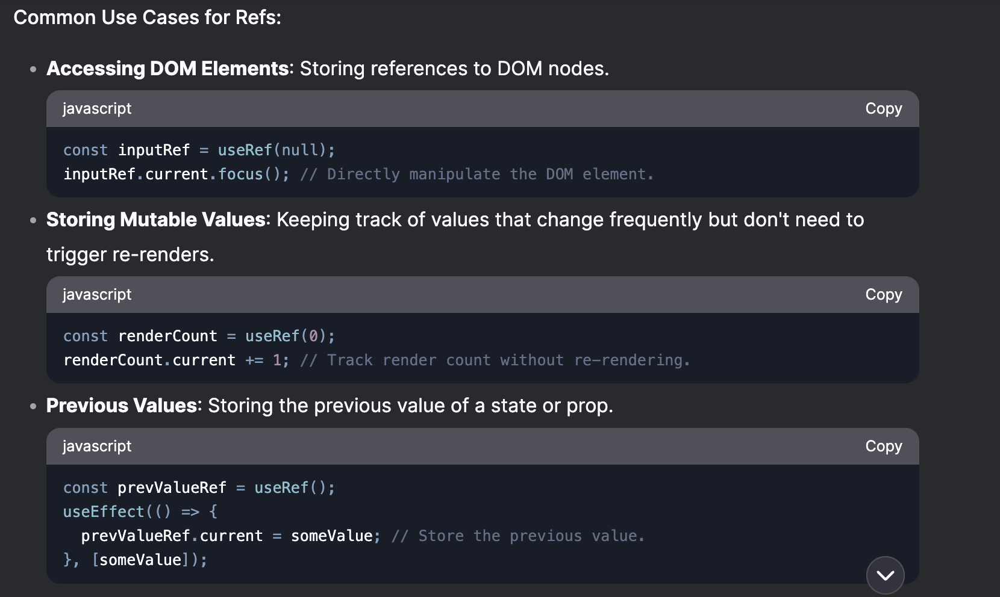
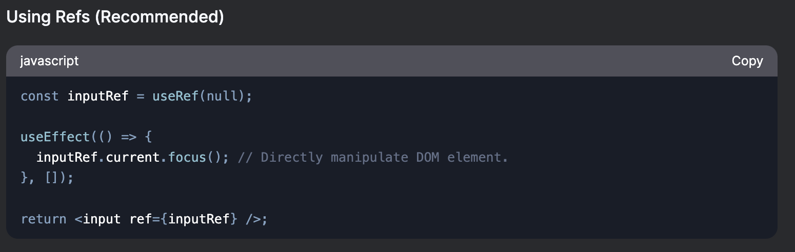

# Render

In React, "render" means converting JSX (or React component logic) into HTML — whether on the server or client.
Render = creating HTML structure from React components
Render = execute your React components to generate a static HTML string.
Render !== displaying on screen, that's the browser's job

1. On the Server (SSR)

   - "Render" = execute your React components to generate a static HTML string.
   - Example:

     ```js
     function App() {
       return <h1>Hello</h1>;
     }
     ```

     SSR renders the above example component as below and this HTML is sent to the browser to be displayed immediately.

     ```html
     <h1>Hello</h1>
     ```

2. On the Client (CSR or Hydration)
   "Render" = run React components in the browser to build the DOM elements.
   The result is what you see on screen (UI).

| Term                | What Happens                                  |
| ------------------- | --------------------------------------------- |
| `render()`          | React converts JSX to HTML (server or client) |
| `ReactDOM.render()` | React attaches the HTML to the actual DOM     |
| `hydrate()`         | React attaches events to existing HTML        |

## Rendering and re-rendering a react component

- Whenever a react component renders a scope is created for that component.
- When the same component renders again then a new scope is created for that component.
- So, every subsequent rendering of a react component creates a new scope and all the declarations are lexically bound to -- that scope.
- Lets assume a react component has rendered 5 times, in that case 5 new scope has been created for the same component and all the declaration and initialization are lexically belonging to their respective scopes. This enables us to have even a variable declared using const keyword getting re-initialized or re-assigned because wrt to that re-render the scope is unique and so in-fact theres no re-declaration or re-assignment going on rather its always the first for every render because of the unique scope created to every render.

but in case of refs
Even though a new scope is created for every render, the ref object itself is not tied to the scope of the render. Instead, it is tied to the component instance.
This means that the ref object is shared across all renders of the component. React keeps some things (like state, refs, effects) persistent outside that scope.

## Scope of the render vs component instance

1. `Scope of the Render / Component Render Scope`

   **What It Is**:

   - Every time a React component renders (or re-renders), a new scope is created for that specific render.
   - This scope is essentially the execution context of the component function during that render.
   - All variables, functions, and declarations inside the component are lexically bound to this scope.

   **Behavior**

   - Variables declared with const, let, or var inside the component are re-declared and re-initialized in the new scope.
   - Functions declared inside the component are re-created in the new scope.
   - Objects and arrays declared inside the component are re-created in the new scope.

   **Key Point**:

   - The scope of the render is temporary and exists only for the duration of that specific render.

2. `Component Instance`

   **What It Is**:

   - The component instance is the persistent representation of the component in React's internal rendering system.
   - It exists for the lifetime of the component (from when it is first mounted until it is unmounted).
   - The component instance manages **state**, **refs**, **hooks** and other persistent data across re-renders.

   **Behavior**

   - State (useState, useReducer) and refs (useRef) are tied to the component instance, not the render scope.
   - These values persist across re-renders because they are stored in the component instance.
   - Hooks like **useEffect**, **useMemo**, and **useCallback** also rely on the component instance to manage their lifecycle and dependencies.

   **Key Point**:

   - The component instance is persistent and exists across multiple renders.

3. 

4. How They Work Together

   1. **During a render**:

      1. React creates a new scope for the component function.
      2. The component function executes, and all declarations inside it are bound to this scope.
      3. React uses the component instance to manage persistent data like state and refs.
      4. After the render, the scope is discarded, but the component instance remains.

   2. **On re-render**:

      1. A new scope is created again.
      2. The component function executes again, and all declarations are re-initialized in the new scope.
      3. React uses the same component instance to access persistent data like state and refs.

5. Practical Implications

   1. **State and Refs**:

      - Use state and refs when you need data to persist across re-renders.
      - Example: Counting the number of renders with a ref (useRef).

   2. **Memoization**:

      - Use useMemo and useCallback to avoid re-creating objects or functions on every render.
      - Example: Memoizing a function to prevent unnecessary re-renders of child components.

   3. **Cleanup**:

      - Use useEffect with a cleanup function to manage side effects tied to the component instance.
      - Example: Adding and removing event listeners.

```js
function MyComponent() {
  // Scope of the render: Re-declared on every render.
  const localVar = Math.random(); // New value on every render.

  // Component instance: Persists across re-renders.
  const [count, setCount] = useState(0); // Persists.
  const renderCount = useRef(0); // Persists.

  useEffect(() => {
    renderCount.current = renderCount.current + 1; // Update ref.
  });

  return (
    <div>
      <p>Local variable: {localVar}</p>
      <p>Count: {count}</p>
      <p>Rendered {renderCount.current} times.</p>
      <button onClick={() => setCount(count + 1)}>Increment</button>
    </div>
  );
}
```

In example above:

- localVar is re-declared and re-initialized on every render.
- count and renderCount persist across re-renders because they are tied to the component instance.

## Summary

- **Scope of the render**: Temporary, re-created on every render. Contains local variables, functions, and declarations.
- **Component instance**: Persistent, exists for the lifetime of the component. Manages state, refs, and other persistent data.

## If both state and refs persist then how to decide which to use when?

1. When to Use State (useState)

   `Use state when`:

   - You need to trigger a re-render when the value changes.
   - The value is tied to the UI and needs to be reflected in the component's output.
   - You want React to manage the value and automatically handle updates.

   `Key Characteristics of State`:

   - `Triggers Re-Render`s: Updating state causes the component to re-render.
   - `Immutable Updates`: State updates are immutable (you replace the old value with a new one).
   - `UI-Driven`: State is typically used for data that directly affects the UI.

   

2. When to Use Refs (useRef)

   `Use refs when`:

   - You need to persist a value across re-renders without triggering a re-render.
   - You need to store mutable data that doesn't affect the UI.
   - You need to access or manipulate DOM elements directly.

   `Key Characteristics of Refs`:

   - `Does Not Trigger Re-Renders`: Updating a ref's current property does not cause a re-render.
   - `Mutable`: You can directly mutate the current property of a ref.
   - `Non-UI Data`: Refs are typically used for data that doesn't directly affect the UI.



## Why can't we access DOM using state instead of using ref?

You can technically access and manipulate the DOM using state in React, but it's not recommended for several reasons.

1. **Why You Can't Use State for DOM Manipulation**

   In theory, you could store a DOM element in state and update it to trigger re-renders. For example:
   However, this approach is not ideal and goes against React's design principles.

   ```js
   const [domElement, setDomElement] = useState(null);
   useEffect(() => {
     const element = document.getElementById("my-element");
     setDomElement(element); // Store the DOM element in state.
   }, []);
   return <div id="my-element">Hello World</div>;
   ```

2. **Why You Shouldn't Use State for DOM Manipulation**

   1. Performance Issues

      1. Unnecessary Re-Renders: Updating state triggers a re-render. If you store a DOM element in state and update it, React will re-render the component unnecessarily, which can hurt performance.
      2. Inefficient DOM Updates: React is designed to efficiently update the DOM through its virtual DOM diffing algorithm. Directly manipulating the DOM using state bypasses this optimization.

   2. React's Declarative Philosophy

      1. React is designed to be declarative: You describe what the UI should look like, and React handles the DOM updates for you.
      2. Using state for DOM manipulation makes your code imperative, which goes against React's design principles and can make your code harder to understand and maintain.

   3. State is for Data, Not DOM Elements

      1. State is meant to store data that affects the UI, not DOM elements themselves.
      2. Storing DOM elements in state can lead to tight coupling between your component logic and the DOM, making your code less reusable and harder to test.

   4. Refs Are Designed for DOM Manipulation
      1. Refs (useRef) are specifically designed for direct DOM access and mutable values that don't trigger re-renders.
      2. They provide a clean and efficient way to interact with the DOM without breaking React's declarative model.

3. **Why Refs Are Better for DOM Manipulation**

   1. No Re-Renders

      1. Updating a ref's current property does not trigger a re-render, making it ideal for DOM manipulation.

   2. Mutable and Persistent

      1. Refs are mutable (you can directly update their current property) and persistent across re-renders.
      2. This makes them perfect for storing references to DOM elements or other mutable values.

   3. Clean Separation of Concerns

      1. Refs allow you to keep your component logic declarative (using state for data) while handling imperative DOM operations separately.
      2. This makes your code easier to understand and maintain.

   4. Example: State vs. Refs for DOM Manipulation

      
      

4. **Key Differences**:
   The state-based approach triggers unnecessary re-renders and tightly couples the DOM element to the component's state.
   The ref-based approach is cleaner, more efficient, and aligns with React's design principles.

## If a parent component re-renders does that make child component to re-render as well?

1. Yes, when a parent component re-renders, its child components will also re-render by default.
2. This is a fundamental behavior in React, but there are ways to optimize and prevent unnecessary re-renders of child components.

   1. **Why Child Components Re-Render When Parent Re-Renders**

      1. In React, re-renders propagate down the component tree by default.
      2. When a parent component re-renders, React will also re-render all of its child components, regardless of whether their props or state have changed.
      3. This happens because React doesn’t automatically know if a child component’s output has changed, so it re-renders the child to ensure the UI stays in sync.

   2. **Example: Parent and Child Re-Renders**

      Behavior:

      1. When the Parent component re-renders (e.g., when count changes), the Child component will also re-render, even though it doesn’t depend on count or any props.
      2. You’ll see the log "Child re-rendered" every time the parent re-renders.

      ```jsx
      function Parent() {
        const [count, setCount] = useState(0);

        return (
          <div>
            <button onClick={() => setCount(count + 1)}>Increment</button>
            <Child />
          </div>
        );
      }

      function Child() {
        console.log("Child re-rendered");
        return <div>Child Component</div>;
      }
      ```

   3. **How to Prevent Unnecessary Child Re-Renders**
      While child re-renders are the default behavior, there are several ways to optimize and prevent unnecessary re-renders:

      1. `React.memo` for Functional Components (in Child Components)

         1. `React.memo`is a higher-order component that memoizes the child component. It prevents re-renders if the child’s props haven’t changed.
         2. Now, the Child component will only re-render if its props change.

         ```jsx
         const Child = React.memo(() => {
           console.log("Child re-rendered");
           return <div>Child Component</div>;
         });
         ```

      2. shouldComponentUpdate for Class Components

         1. In class components, you can use shouldComponentUpdate to control re-renders manually.
         2. Example

         ```jsx
         class Child extends React.Component {
           shouldComponentUpdate(nextProps, nextState) {
             // Only re-render if specific props or state change.
             return false; // Prevent re-renders entirely.
           }

           render() {
             console.log("Child re-rendered");
             return <div>Child Component</div>;
           }
         }
         ```

      3. Passing Stable Props: `useMemo()` in parent component

         1. If a child component depends on props, ensure that the props are stable (e.g., not re-created on every render).
         2. Example

         ```jsx
         function Parent() {
           const [count, setCount] = useState(0);
           const stableProp = useMemo(() => ({ key: "value" }), []); // Memoize props.

           return (
             <div>
               <button onClick={() => setCount(count + 1)}>Increment</button>
               <Child stableProp={stableProp} />
             </div>
           );
         }

         const Child = React.memo(({ stableProp }) => {
           console.log("Child re-rendered");
           return <div>Child Component</div>;
         });
         ```

      4. Important Caveats

         1. `React.memo` only **shallowly compares props**. For deep objects or functions, you may still see re-renders unless you use `useCallback` or `useMemo`.
         2. Overusing React.memo can backfire. It adds comparison overhead and should be used where re-renders are actually a problem.

      5. Using Context Wisely

         1. If a child component consumes context, it will re-render whenever the context value changes, even if its props don’t change.
         2. To optimize, you can:
            1. Split contexts into smaller, more specific contexts.
            2. Use React.memo to prevent re-renders if the child doesn’t depend on the context.

      6. Using `useMemo` and `useCallback`

         1. Memoizes values and functions before passing to child components to prevent unnecessary re-renders.
         2. Example

         ```jsx
         function Parent() {
           const [count, setCount] = useState(0);
           const memoizedCallback = useCallback(() => {
             console.log("Callback");
           }, []);

           return (
             <div>
               <button onClick={() => setCount(count + 1)}>Increment</button>
               <Child onClick={memoizedCallback} />
             </div>
           );
         }

         const Child = React.memo(({ onClick }) => {
           console.log("Child re-rendered");
           return <div>Child Component</div>;
         });
         ```

   4. When Child Re-Renders Are Necessary
      1. Child components should re-render if:
      2. Their props change.
      3. Their internal state changes.
      4. They consume context that has changed.

3. Key Takeaways
   1. By default, child components re-render when their parent re-renders.
   2. You can optimize this behavior using:
   3. `React.memo`, `useMemo`, `useCallback` for functional components and `shouldComponentUpdate` for the class components.
   4. Memoizing props and callbacks with useMemo and useCallback.
   5. Using context wisely.

## Why React.memo Isn’t Used Everywhere to prevent unnecessary re-render of the child component

1. Performance Overhead of React.memo
2. Not All Components Need Optimization
3. Premature Optimization:
   - Wrapping every component with React.memo can be a form of premature optimization.
   - It’s better to first build the application and then identify performance bottlenecks using tools like the React DevTools Profiler.

## When to Use React.memo

1. Heavy or Complex Child Components

   1. Use React.memo for components that are expensive to render (e.g., large lists, complex UI elements).

2. Frequently Re-Rendered Components

   1. Use React.memo for components that re-render frequently but don’t actually need to (e.g., components that depend on stable props).

3. Components with Stable Props

   1. Use React.memo for components that receive stable props (e.g., props that don’t change often or are memoized with useMemo or useCallback).

4. Example: When React.memo Shines

   ```jsx
   function Parent() {
     const [count, setCount] = useState(0);
     const stableProp = useMemo(() => ({ key: "value" }), []);

     return (
       <div>
         <button onClick={() => setCount(count + 1)}>Increment</button>
         <Child stableProp={stableProp} />
       </div>
     );
   }

   const Child = React.memo(({ stableProp }) => {
     console.log("Child re-rendered");
     return <div>Child Component</div>;
   });
   ```

   Behavior:

   - The Child component only re-renders if stableProp changes.
   - Since stableProp is memoized, it remains stable, and the Child doesn’t re-render unnecessarily.

5. When Not to Use React.memo

   1. `Simple Components`
      For small, lightweight components, the overhead of React.memo might not be worth it.

   2. `Components with Frequently Changing Props`
      If the props change frequently, React.memo won’t prevent re-renders, and the comparison overhead might hurt performance.

   3. `Components with Context or State`
      If a component relies on context or internal state, React.memo won’t prevent re-renders when the context or state changes.

6. Best Practices
   1. Measure First: Use tools like the React DevTools Profiler to identify performance bottlenecks before optimizing.
   2. Optimize Strategically: Only use React.memo for components that actually need it.
   3. Memoize Props: **Use useMemo and useCallback to stabilize props passed to memoized components.**
   4. Keep It Simple: Avoid over-optimizing unless necessary.

---

## Additional Concepts to Consider regarding rendering and re-rendering of react component

1. React’s Rendering Phases
   React’s rendering process can be broken down into two main phases:

   1. `Render Phase`: React creates a new virtual DOM tree by calling the component’s render function (or functional component’s return statement). This phase is pure and has no side effects.
   2. `Commit Phase`: React compares the new virtual DOM with the previous one (reconciliation) and applies the necessary changes to the actual DOM. This phase can have side effects (e.g., DOM updates, effects).

2. Reconciliation and Diffing Algorithm

   1. React uses a diffing algorithm to determine what has changed in the component tree and updates the DOM efficiently.
   2. Keys are used to help React identify which items have changed, been added, or been removed in lists.
   3. Understanding how React optimizes updates (e.g., batching, skipping unnecessary re-renders) can deepen your explanation.

3. Memoization and Performance Optimization

   1. `React.memo`: Prevents unnecessary re-renders of functional components if their props haven’t changed.
   2. `useMemo`: Memoizes expensive calculations to avoid recomputing them on every render.
   3. `useCallback`: Memoizes functions to prevent unnecessary re-renders of child components.
   4. While they often work together (React.memo with useCallback or useMemo with useCallback) for optimal performance, useCallback has independent value.
   5. It's not accurate to say that `React.memo` is always used with `useMemo`.
   6. It's not accurate to say that `React.memo` is always used with `useCallback`.

4. Effect Lifecycle

   1. useEffect has a cleanup phase that runs before the effect is re-executed or when the component unmounts.
   2. Understanding the dependency array and how it controls when effects run is crucial for avoiding bugs and performance issues.

5. Context and Re-Renders

   1. When a context value changes, all components that consume that context will re-render, even if their props or state haven’t changed.
   2. Techniques like splitting contexts or using memo can help optimize performance.

6. Error Boundaries

   1. Error boundaries catch errors during rendering and allow you to display a fallback UI.
   2. They are implemented using class components (componentDidCatch), but there’s no direct equivalent in functional components yet.

7. Server-Side Rendering (SSR) and Hydration

   1. In SSR, React components are rendered on the server, and the HTML is sent to the client
   2. Hydration is the process of attaching event listeners to the SSR components and making the HTML interactive on the client side.
   3. Hydration is the process where React takes the static HTML generated by the server (SSR) and attaches event listeners, restoring full interactivity on the client side.

8. Strict Mode and Development-Only Behavior

   1. In development mode, React’s Strict Mode intentionally double-invokes certain functions (e.g., render, effects) to help detect side effects.
   2. This behavior can be confusing if not understood, but it’s a powerful tool for catching bugs early.

9. Custom Hooks and Re-Renders

   1. Custom hooks can encapsulate state and logic, but they are tied to the component instance.
   2. Understanding how custom hooks affect re-renders and how to optimize them is important for building reusable logic.

10. Portals and Re-Renders
    1. Portals allow rendering a component’s output outside its parent DOM hierarchy.
    2. Understanding how re-renders work with portals can help manage complex UIs (e.g., modals, tooltips).

---

## Updated Summary: Deep Dive into Rendering and Re-rendering

Your explanation is already very thorough, but including the above topics would make it even more comprehensive. Here’s a revised summary of what a complete deep dive into rendering and re-rendering might include:

**Core Concepts:**

- **Scope of the Render:**
  - Temporary, re-created on every render.
  - Contains local variables, functions, and declarations.
- **Component Instance:**

  - Persistent, exists for the lifetime of the component.
  - Manages state, refs, and other persistent data.
  - You won’t see it in your code, but internally, React manages this instance as a Fiber node (part of React’s reconciliation engine).
  - Every rendered component has its own instance.
  - `When a Component Re-renders, Its Instance Remains the Same. But the scope of the component change on each render.`
  - It’s an object that React keeps in memory, with fields like:

    ```js
       {
        state: { count: 0 },
        ref: { current: null },
        hooks: [...],
        props: {},
        ...
      }
    ```

- **State vs. Refs:**
  - Use **state** for UI-driven data that triggers re-renders.
  - Use **refs** for mutable data or DOM manipulation that doesn’t trigger re-renders.
- **Reconciliation and Virtual DOM:**
  - React’s diffing algorithm minimizes DOM updates.
  - **Keys** help React identify changes in lists.
- **Rendering Phases:**
  - **Render phase** (pure, no side effects).
  - **Commit phase** (applies changes to the DOM).
- **Batching and Concurrent Rendering:**
  - React batches state updates for performance.
  - Concurrent rendering allows prioritizing updates.
- **Memoization and Optimization:**
  - Use `React.memo`, `useMemo`, and `useCallback` to optimize performance.
- **Effect Lifecycle:**
  - `useEffect` runs and cleans up based on dependencies.
- **Context and Re-Renders:**
  - Context changes trigger re-renders in consuming components.
- **Error Boundaries:**
  - Catch errors during rendering and display fallback UI.
- **SSR and Hydration:**
  - Server-side rendering and client-side hydration.
- **Strict Mode:**
  - Development-only behavior to catch side effects.
- **Custom Hooks:**
  - Encapsulate logic and state, tied to the component instance.
- **Portals:**
  - Render components outside their parent DOM hierarchy.

## SSR & Hydration

- The server executes your React components.
- It generates static HTML output (just like what the browser would normally render).
- That HTML is sent to the browser.
- The browser shows the HTML immediately (fast first paint, good for SEO).
- Then hydration happens: React loads in the browser and attaches event listeners and re-creates the vDOM, client-side state, etc. Virtual DOM is recreated on the client during hydration.
  - On the client, React hydrates the HTML — it `attaches event listeners` and `re-creates the virtual DOM`.
  - Hydration is when the browser takes static HTML from SSR and makes it interactive by attaching React’s logic (event handlers, state, etc.).
  - HTML is already there from the server.
  - React “hydrates” it → adds events, hooks, interactivity.
- SSR/SSG give you HTML early, but they depend on CSR to make your app work

## ✅ Does CSR Also Convert Components to HTML?

Yes — even in **Client-Side Rendering (CSR)**, React components **must be converted to HTML**, otherwise the browser wouldn't know what to show.

---

## Use Cases for respective rendering types

| Rendering Type | Use Case Examples                          |
| -------------- | ------------------------------------------ |
| CSR            | Internal dashboards, tools, apps           |
| SSR            | Authenticated pages, SEO-sensitive content |
| SSG            | Blogs, marketing sites, docs               |
| ISR            | Product listings, news pages, pricing      |
