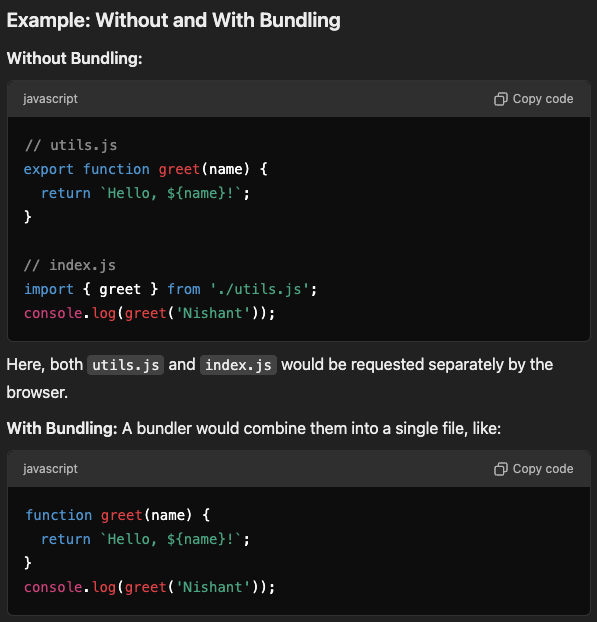
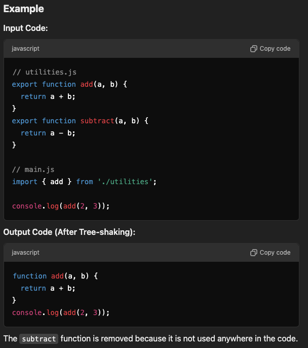
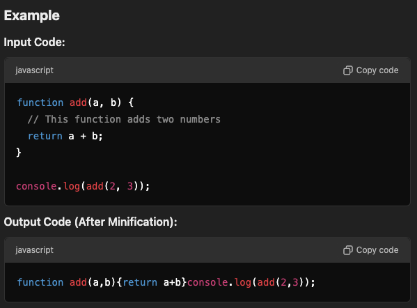

# Bundling Modules

- Bundling modules in JavaScript refers to the process of combining multiple JavaScript files (modules) into a single file (or a few files) to optimize for web performance.
- This is especially important in modern web development, where applications are built using modular code for maintainability and scalability.

## How Bundling Works

When you use a bundler (like Webpack, Rollup, Parcel, or Vite), it:

1. Analyzes the Dependency Graph: Starts from an entry point (e.g., index.js) and recursively resolves all import or require statements.
2. Combines Files: Merges all the code into one or more output files.

   1. `JavaScript`: Bundles all your JS modules into one or more files.
   2. `CSS`: Combines all CSS into a single file (e.g., styles.css) using plugins like MiniCssExtractPlugin.
   3. `Images`, Fonts, and Other Files: Typically copied or referenced as separate files, with optimized names (e.g., hashed filenames like logo.abc123.png).
   4. `HTML`: If using html-webpack-plugin, generates or modifies an HTML file that includes the references to these bundles.
      
      

3. Applies Optimizations:
   - `Tree-Shaking`: Removes unused exports.
   - `Code Splitting`: Splits code into chunks to load only what's needed (e.g., lazy loading).
   - `Minification`: Shrinks the code for faster delivery.

## Tools for Bundling

1. `Webpack`: Highly configurable, supports loaders and plugins for various tasks.
2. `Rollup`: Best for libraries and optimized ES module bundling.
3. `Parcel`: Zero-config bundler, suitable for simpler setups.
4. `Vite`: Focuses on development with fast HMR and supports production builds.

## Why Bundle Modules

1. `Reduce HTTP Requests`: Combining multiple files into one reduces the number of network requests, which improves page load times.

2. `Dependency Management`: Ensures that all required modules are included in the correct order, resolving dependencies automatically.

3. `Optimize for Production`: Minifies code (removes whitespace, comments, etc.), applies tree-shaking (removes unused code), and compresses assets for faster delivery.

4. `Browser Compatibility`: Converts modern JavaScript (ES6+ modules) into older formats (like CommonJS or AMD) for compatibility with older browsers if needed.

## Key Difference Without a Bundler

- The primary limitation is that assets are not treated as modules, and you cannot include them directly in your JavaScript code. This means:
  - You can't "import" them like you do in Webpack.
  - You must reference them explicitly in your project structure.

## Can You "Bundle" Without a Bundler?

- You cannot create a single bundled file that combines JavaScript, CSS, and other assets.
- The browser or runtime will load them as separate files (e.g., separate network requests for each script, CSS, or image).

## Bundler creates separate Bundles for Each Asset Type

1. `JavaScript`: Bundles all your JS modules into one or more files.
2. `CSS`: Combines all CSS into a single file (e.g., styles.css) using plugins like MiniCssExtractPlugin.
3. `Images, Fonts, and Other Files`: Typically copied or referenced as separate files, with optimized names (e.g., hashed filenames like logo.abc123.png).
4. `HTML`: If using html-webpack-plugin, generates or modifies an HTML file that includes the references to these bundles.
   
   

## Tree-shaking by Bundlers

1. Tree-shaking is a technique that eliminates unused code from the final bundle. It analyzes the dependency graph of your code and removes dead or unreachable code (functions, variables, modules, etc.) that are not used in your application.

2. How It Works

   1. `ES6 Modules (Static Analysis)`:

      - Tree-shaking relies on ES6 modules (import/export) because they allow static analysis at build time.
      - The bundler can determine which exports are actually used and exclude the unused ones.

   2. `Mark and Sweep`:

      - The bundler marks all the code paths that are reachable (used) in the application.
      - It then "shakes off" the unused or unreachable parts.

   3. 

3. Requirements for Tree-shaking
   1. `ES6 Modules`: It doesn't work with `CommonJS` (require/module.exports) as they are dynamic and harder to statically analyze.
   2. `Side-effect-free Code`: Tree-shaking works best when your code and dependencies are written without unexpected side effects.
      

## Minification

1. Minification is the process of reducing the size of the code by removing unnecessary characters and performing certain optimizations without altering its functionality.
   This includes:

   - Removing whitespace, comments, and unnecessary characters.
   - Shortening variable names.
   - Collapsing redundant code.

2. How It Works
   Minification involves parsing the code into an Abstract Syntax Tree (AST), optimizing it, and generating the output with reduced size.
   

3. Benefits of Minification
   1. Smaller Bundle Size: Reduces the amount of data transferred over the network.
   2. Faster Load Times: Smaller files are downloaded and parsed faster by the browser.

## Tree Shaking vs Minification

Tree-shaking: Removes dead code first.
Minification: Compresses the resulting code.

## Code Splitting by Bundlers

1. `Description`: Splits JavaScript and CSS into smaller, logical chunks or bundles. Assets are loaded on demand (lazy loading) or grouped together based on usage.
2. `Use Case`: Improves performance by:
   - Loading only the code needed for the current page or feature.
   - Avoiding unnecessary downloads for pages or features the user doesn’t visit.
     

## Asset Optimization and Referencing

Images, Fonts, PDFs

1. Inlining: Small files (e.g., small SVGs or PNGs) can be inlined into JavaScript or CSS as Base64 strings using url-loader.
   

2. Hashed Filenames: Larger files are kept separate but given hashed names for cache busting.
   
