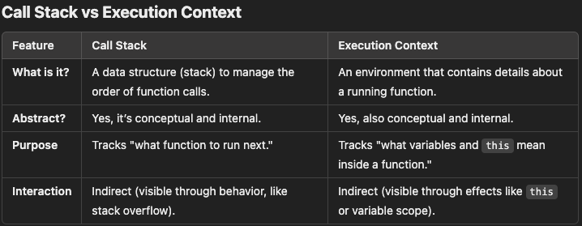

# Execution Context = an internal record (object-like structure)

- Whenever JavaScript runs code:

  - Global code → creates Global Execution Context
  - Function call → creates a Function Execution Context
  - eval → creates an eval Execution Context

- Each Execution Context contains 3 important components:

  - Lexical Environment
  - Variable Environment
  - This Binding
    This whole thing is stored on the "Execution Context Stack" (Call Stack).

- The JS engine creates a structured “record”:

  ```sql
    ExecutionContext = {
      LexicalEnvironment: { ... },
      VariableEnvironment: { ... },
      ThisBinding: value
    }
  ```

  👉 This is NOT created as a JS object using {}
  👉 But engine stores it in a similar form internally

  So conceptually, YES — it is an object. But why do we say “object-like” instead of “object”.
  ❌ You can’t log it
  ❌ You can’t reference it
  ❌ You can’t read or modify its properties
  It’s completely internal to the JS engine.
  ✔️ But the engine implements it like a structured record with fields

  ```js
  console.log(executionContext); // impossible
  ```

- An Execution Context is a container that holds information about the environment in which the code is executed.
- An Execution Context is created whenever a function (except for arrow functions) is invoked, or when the global code is run (i.e., the first time the JavaScript engine starts executing the code).

- In javascript callstack has `stacks of execution contexts`.
- A new execution context gets created only when a new function gets called.
- Even if there's no new function called or a new function called, there's global execution context always.
- Whenever code is run on the javascript engine a global execution context is created. It is also called `base/global` execution context in nodejs or `window` execution context in Browser Javascript Runtime environment.

- An execution context in JavaScript represents the environment in which JavaScript code is evaluated and executed. When a function is called, a new execution context is created for that function, and it includes all the necessary information for the function's execution, such as its scope chain, local variables, and arguments.

- `Within a single execution context, code is executed sequentially`, following the order in which it appears in the code. This means that statements within the same function are executed in the order they are written, from top to bottom. There's no reordering based on LIFO or FIFO principles within the same execution context.

- The LIFO principle applies at the level of the call stack, where execution contexts are pushed and popped as functions are called and return. But within each individual execution context, the code executes in a straightforward, sequential manner.

- It contains:

  - The **variable environment**: This includes all variables and function declarations defined in the context.
  - The **scope chain**: The chain of scopes that helps the engine resolve variables.
  - The **value of this**: The context in which the code is running (in the case of functions, it’s the object on which the function was called).

- The Execution Context in JavaScript is an environment where JavaScript code is executed.
- It determines what code is currently running, the scope, and how variables and functions are accessed.
- Understanding execution context is fundamental to grasping concepts like scope, closures, and the this keyword.
- What is an Execution Context?

  - An execution context is an abstract concept in JavaScript that contains:

    1. `this` Binding: A reference to the object that the function is operating on (or the global object, or undefined in strict mode).

    2. `Variable Environment`: Storage for all the variables and function declarations inside the function.

    3. `Lexical Environment`: Information about the parent scopes (used for resolving variables).

The execution context is a conceptual environment, not an object, but it includes:

    1. `this`, which typically points to an object.
    2. The variable environment and lexical scope.

So while the execution context itself is abstract, the this inside it often refers to an object, which can sometimes make it feel like the execution context is tied to that object.

## What Does "Abstract" Mean?

In general, "abstract" means something that is not directly tangible or visible but is conceptual or theoretical. It exists in a logical or conceptual sense rather than as a physical or directly observable thing.

- Think of "abstract" as "you can understand it, but you can't touch or see it directly."
- It's like the idea of "time"—you can measure and experience it, but you can't physically hold it.

## How is Execution Context Abstract in JavaScript?

- The execution context is a logical construct created by the JavaScript engine every time a function or global code is executed.
- The execution context is abstract because it’s an internal mechanism of the JavaScript engine.
- You can’t see or directly interact with it in your code, but it determines how the code runs (e.g., resolving this, variables, and scope).
- It is not something you can see or directly interact with in your code, like an object or a variable.
- However, it exists conceptually and plays a crucial role in determining:

  - How variables are resolved.
  - What the value of this is.
  - The function's environment.

- Abstract does not mean "not real" or "not important."
- Abstract here just means you can't directly access it in your code, but the JavaScript engine uses it internally to execute your program.

## Is the Execution Context an Object?

- No, the execution context itself is not an object you can directly access.
- However:
  - The this value, which is part of the execution context, typically refers to an object.
  - When a function executes, the `this` value is determined and becomes a part of the execution context.
- In simpler terms:
  - The execution context is not an object.
  - But it includes information (like the value of this) that often refers to an object.

## Relationship Between Execution Context and Object

While the execution context is not itself an object, it has a this binding that refers to an object in most cases:

- In global execution: this refers to the global object.
- In a method: this refers to the object calling the method.
- In explicitly bound functions: this refers to the bound object.

## Call Stack and Execution Context

- The JavaScript engine maintains a **call stack**, which is a stack of `execution contexts`.
- `Call Stack`: JavaScript uses a call stack to manage execution contexts. The global context is at the bottom, and new contexts are pushed on top when functions are invoked.
- **LIFO** (Last In, First Out) order is followed: the most recently created execution context is placed on top of the stack.
- When a function is invoked, its **Execution Context** is pushed onto the call stack.
- Once the function finishes execution, its **Execution Context** is popped off the stack, and the execution continues in the context below it.
- Like the execution context, the call stack in JavaScript is also an abstract concept.
- the call stack is a conceptual model used by the JavaScript engine to manage the execution of function calls.
- You cannot directly see or manipulate the call stack in your code, but understanding how it works is crucial to understanding how JavaScript executes code.
  

---

## Key points

`Call Stack`: Manages function calls and execution contexts.
`Hoisting`: Moves declarations to the top of their scope. Only declarations are hoisted, not their initialization.
`Scope`: Determines variable accessibility.
`Scope Chain`: Resolves variables by looking up the chain of lexical environments.
`Lexical Environment`: Runtime data structure holding variables and outer scope references.
`Temporal Dead Zone`: Exists for let and const before their declaration.
`Closures`: Enable functions to retain access to their outer lexical environments.
`Event Loop`: Handles asynchronous execution in JavaScript.
`Prototype Chain`: Resolves object property access.
`Shadowing`: Inner variables with same identifier as outer variables can override outer variables.
`this`: The keyword this in JavaScript refers to the execution context (not directly to an object), but it can be bound to an object depending on how the function is invoked.

## There are four types of execution contexts in modern JavaScript

Global Execution Context (GEC): For the main script.
Function Execution Context (FEC): For each function call.
Eval Execution Context (EEC): For eval code (rarely used).
Module Execution Context(MEC): For each ES Module when evaluated.
