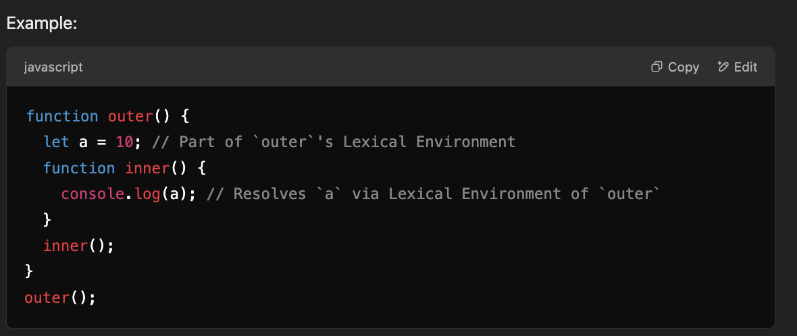
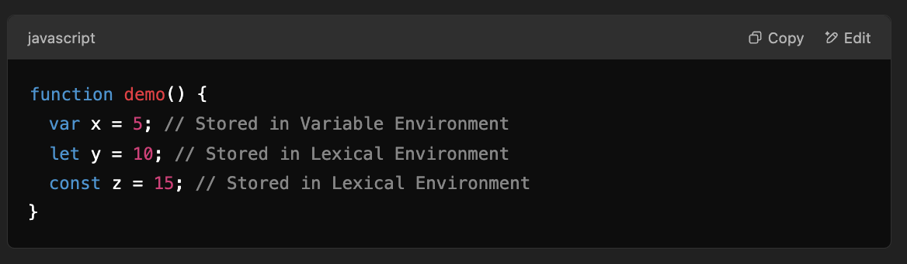
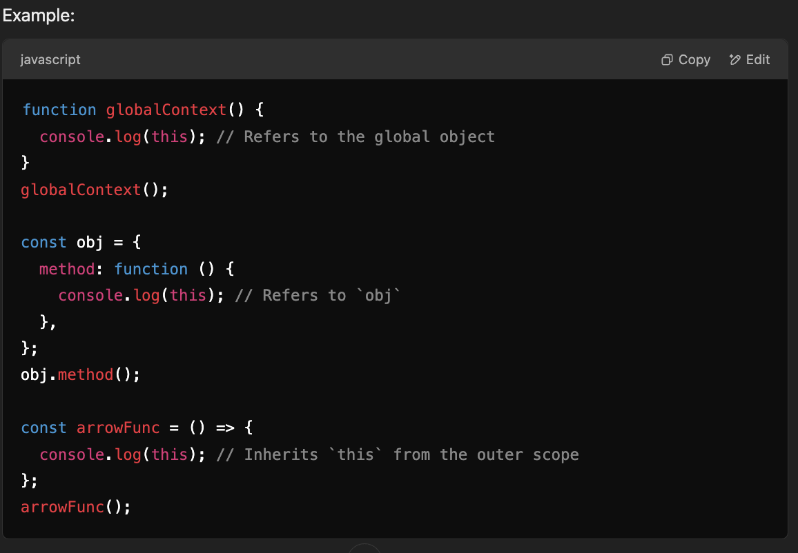

# Components of Execution Context

1. **Lexical Environment:**

   - A structure that holds the environment record (variables and functions) and a reference to its outer environment.
   - Stores variable bindings (e.g., `let`, `const`, `var`) and function declarations.
   - Points to the Lexical Environment of the parent (outer) scope, forming a scope chain.
   - Determines scope and enables closures.

   

2. **/Variable Environment**:

   - The Variable Environment is similar to the Lexical Environment but is specifically responsible for:
     - Managing `var` declarations.
     - Tracking the variables' values within the function.

   

   Note: In modern JavaScript, the `Lexical Environment` and `Variable Environment` overlap significantly because let, const, and var are managed together. However, historically, var declarations were treated differently due to their function-scoped behavior.

3. **this Binding:**

   - Determines the value of `this` based on how a function is invoked.
   - It refers to the object that is executing the current function.
   - The binding of this depends on the execution context type
     - `Global Context`: this refers to the global object (window in browsers or global in Node.js).
     - `Function Context`: Depends on the calling object (default is global object in non-strict mode, or undefined in strict mode).
     - `Arrow Functions`: Do not have their own this. They inherit this from the enclosing Lexical Environment.

   
