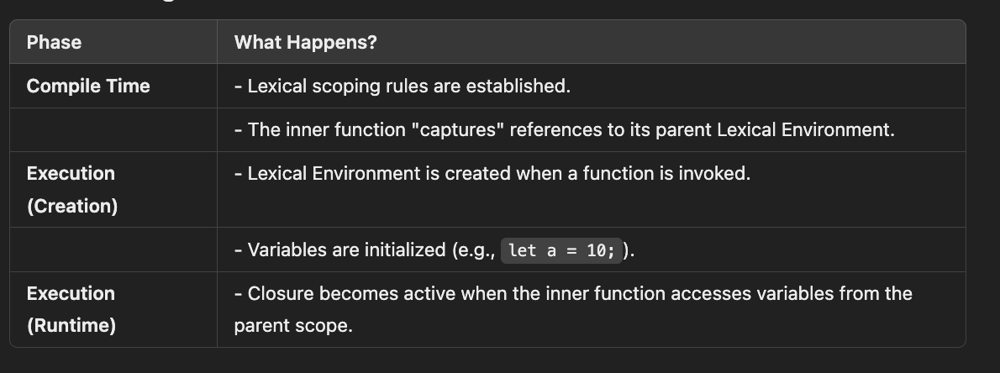

# Resolving Variables (Lexical Scoping)

- Variables in js is resolved during the compilation time
- JavaScript uses lexical scoping, which means the scope of a variable is determined by its position in the source code.

- When the code is compiled (not executed), JavaScript creates a Lexical Environment that determines where each variable can be accessed.



## Lexical(Structural) Scope

"lexical scoping" (or "static scoping") means that the scope of a variable is determined by where it is defined in the source code.

Scope of a function along with its parent execution context scope

In javascript our lexical scope (available data + variables where the function was defined) determines our available variables. Not where the function is called (dynamic scope)

Arrow functions are lexically bound i.e. arrow functions has a lexical this behavior unlike normal functions.

```javascript
// Example 1
const a = function () {
  console.log(this);
  const b = function () {
    console.log(this);
    const c = {
      hi: function () {
        console.log(this);
      },
    };
    c.hi(); // returns "c" object
  };
  b(); // returns window object
};
a(); // returns window object

// Example 2
const obj = {
  name: "Billy",
  sing() {
    console.log("a", this);
    var anotherFunc = function () {
      console.log("b", this); // here, value of this will be window becuase normal functions inside a function are not lexically bound
      // this is not lexically bound
      // this is dynamically bound
    };
    var againAnotherFunc = () => {
      console.log("b", this); // here, value of this will be "obj" object because arrow function is lexically bound so the value of this is inherited from the value in parent function executon context which is sing().
    };
    anotherFunc();
  },
};

obj.sing();

// Example 3 - another way of binding this to a function exection context
const obj = {
  name: "Billy",
  sing() {
    console.log("a", this);
    var anotherFunc = function () {
      console.log("b", this); // here, value of this will be "obj" object becuase we are using bind
    };

    // binding an object to a function
    return anotherFunc.bind(this)(); // returns reference to another Func whose execution context will now have value of this equal to "obj" object.
  },
};
obj.sing();

// Example 4 - again another way of binding this to a functions exection context
const obj = {
  name: "Billy",
  sing() {
    console.log("a", this);

    const self = this;
    var anotherFunc = function () {
      console.log("b", self); // here, value of this will be "obj" object becuase we are using bind
    };

    anotherFunc(); // returns reference to another Func whose execution context will now have value of this equal to "obj" object
  },
};
obj.sing();
```

## Lexical/Static/Structural Scoping

**Lexical Scoping**: JavaScript uses lexical scoping, meaning the scope of an identifier is determined by its position in the code at the time of writing (its "lexical" position).

1. Lexical Scope:

   - JavaScript uses lexical scoping, which means the scope of a variable is determined by its position in the source code.
   - When the code is compiled (not executed), JavaScript creates a Lexical Environment that determines where each variable can be accessed.

2. Compilation Time (Variable Resolution):

   - During the creation phase of the execution context (before any code is run), the JavaScript engine:
     - Scans the code.
     - Creates a scope chain based on where variables and functions are defined in the code.
     - Allocates memory for variables and functions within their respective scopes.
   - The parent Lexical Environment reference is established for nested functions, enabling scope chaining.

3. Execution Time:

   - During execution, the JavaScript engine uses the scope chain (established during compilation) to resolve variable references.
   - If a variable is not found in the current scope, the engine looks up the parent scope, continuing until it reaches the global scope or determines the variable is undefined.

## Scope Chain

- The scope chain is the mechanism by which JavaScript resolves variable access. It works by looking up variables in the current scope and then moving to outer (parent) scopes until it finds the variable or reaches the global scope.

- Scope Chain: The hierarchical structure of scopes, where inner functions can access variables from their outer (parent) functions.

- Each execution context has link to its outer/parent execution context. This link is called scope chain.

- All FEC's have their own variable environment via which they have access to their own variables but they also have link to the variable environment of the parent FEC this link is called scope chain.

- Scope chain gives access to the variable that are in parent environment.

- The outer environment depends on where the functions sits lexically.

- Each execution context has access to the variable environment of its parent execution context but not vice versa.

- a grand children execution context will have access to both its parent and grand parent environment variables, reverse is not true.

## Key Takeaway

- Lexical Scope is defined during compilation time, and variables are resolved based on this pre-established scope chain.
- At execution time, the engine simply uses the scope chain to access variables.
