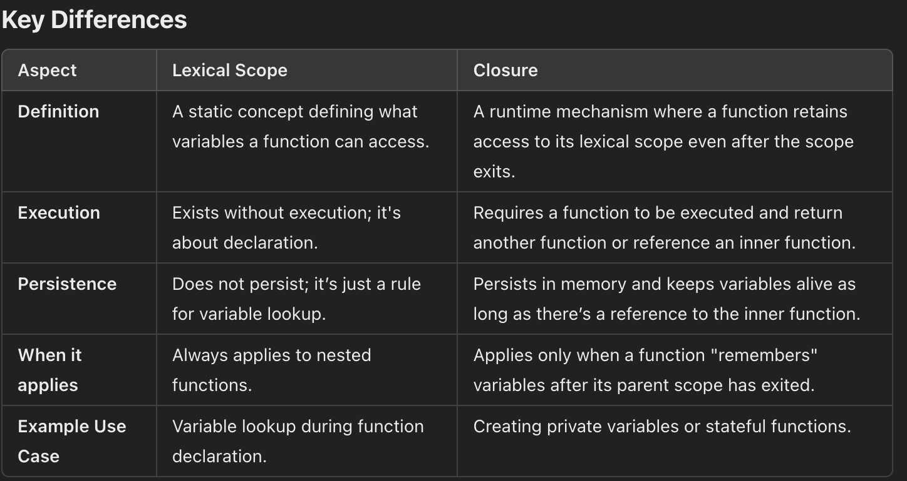

# Closures

- A closure is created when a function, using lexical scope, "remembers" those variables even after the outer scope is gone.
- A closure is created ANY TIME a function is defined inside another function — whether or not it is returned.
- Closure requires the inner function definition to be literally written inside the parent component. ❌ This is not true.
- Closure happens whenever a function is CREATED inside another function’s execution. Not where it is written in the file, but where it is created during execution.
- Inner function doesn't need to be inside the outer function's code block directly, it should be lexically inside of the outer and function and outlive outer function the closure is formed. For example an when inside any function we call setTimeout, this setTimeout has a callback function, this callback function is not directly inside the parent function rather lexically inside, same goes for the useEffect hook inside a react component.

- **A closure is formed even if the inner function is not directly written inside the outer function’s code block. What matters is:**

  - `The inner function is created inside the outer function’s lexical environment (i.e., during the execution of the outer function)`
  - `The inner function accesses variables from that outer lexical environment`
  - `The inner function outlives the outer function’s execution` for outliving we have many ways not just only returning the inner function by the outer.

  If these three conditions are true → closure is created.

- 
- Eg1:

  ```Javascript
    function outer() {
    let outerVar = "I'm outer!";
    return function inner() {
      console.log(outerVar); // Closure in action, relies on lexical scope
    };
  }
  const innerFunc = outer(); // Closure created here
  innerFunc(); // Output: "I'm outer!"
  ```

- Eg2:

  ```js
  function outer() {
    let x = 10;

    function inner() {
      console.log(x); // uses x → closure
    }

    setTimeout(inner, 1000);
  }
  ```

  - Eg3: In React Component

  ```js
  function App() {
    const [count] = useState(0);

    function handleClick() {
      console.log(count); // refers to outer variable → CLOSURE!
    }

    return <button onClick={handleClick}></button>;
  }
  ```

  - Eg4: In React component inline function

    ```jsx
    function App() {
      const [count] = useState(0);
      setTimeout(() => console.log(count), 1000); // This ALSO creates closure

      // This ALSO creates closure
      window.addEventListener("scroll", () => {
        console.log(count);
      });

      // This ALSO creates closure
      useEffect(() => {
        console.log(count);
      }, []);

      // Even passing a function to any library creates closure
      socket.on("message", () => console.log(count));

      return <button onClick={() => console.log(count)} />; // This ALSO creates closure
    }
    ```

JavaScript creates closures ANYWHERE an inner function uses outer variables, even if NOTHING is returned.
A closure is created whenever a function remembers variables from the scope in which it was created — return is NOT required.

**❌ Misconception: “Closures happen only when a function RETURNS another function.”:**
**✅ Reality**

A closure is created ANY TIME a function is defined inside another function —
whether or not it is returned.

That’s it.
Closures are automatically created on definition, not on return.

## What Actually Creates a Closure?

A closure is created when BOTH are true:

1. A function is defined inside another function
2. The inner function uses variables from the outer function

Does the outer function have to return the inner one?
❌ NO. Returning is NOT required.
Binding a callback to a button/event/timeout also creates a closure.

- Closure requires the inner function definition to be literally written inside the parent component. ❌ This is not true.
- Closure happens whenever a function is CREATED inside another function’s execution. Not where it is written in the file, but where it is created during execution.

## Closure vs Lexical Scope

1. LEXICAL SCOPE (always happens)
   Whenever you write:

   ```js
   function outer() {
     let x = 10;

     function inner() {
       console.log(x);
     }
   }
   ```

   The inner function can see x because of lexical scoping.

   ➡️ This access exists ONLY while the outer function is running.
   ➡️ This is NOT closure yet.
   ➡️ This is just JavaScript scope rules.

   Eg:
   Case 1: No closure (just lexical scope)

   ```js
   function outer() {
     let x = 10;

     function inner() {
       console.log(x);
     }

     inner(); // Called before outer ends
   }
   ```

   Here:

   inner is defined → JS prepares closure blueprint
   inner is called immediately → sees x via lexical scope
   outer finishes → inner no longer matters

   ➡️ No closure persists
   ➡️ NOT a closure use case
   ➡️ Just lexical scope

   Case 2: Closure truly happens

   ```js
   function outer() {
     let x = 10;

     return function inner() {
       console.log(x);
     };
   }

   const fn = outer();
   fn(); // outer is finished, but still prints x
   ```

   Now:

   inner OUTLIVES outer
   so x must remain alive
   JavaScript creates a CLOSURE

   Case 3: Closure without returning

   ```js
   function outer() {
     let x = 10;

     setTimeout(function inner() {
       console.log(x);
     }, 1000);
   }
   ```

   Here’s what happens:

   - inner is defined → closure blueprint created
   - inner is saved by setTimeout, NOT destroyed
   - outer exits
   - timeout fires after 1 second
   - inner STILL needs access to x
   - therefore JS creates & keeps a closure

   This is a closure EVEN THOUGH inner is not returned.

   Because:

   ➡️ The inner function survives
   ➡️ It is executed after outer has returned
   ➡️ Therefore closure persists outer variables

2. CLOSURE (happens only if inner function OUTLIVES outer function)
   A closure is created when the inner function survives after the outer function returns.
   Closure = inner function + preserved outer variables after the outer function is gone
   This ONLY happens when the inner function is:

   - `returned`
   - `or stored`
   - `or passed elsewhere`
   - `or scheduled for later (callback)`
   - `or attached as an event handler`
   - `or saved in a ref`
   - `or saved in a module`
   - `or used in async logic`

   In these cases, the outer function has finished,
   but the inner function is still alive → closure.

HE KEY DISTINCTION

✔️ Lexical scope → inner function can access outer variables WHILE outer is still running
✔️ Closure → inner function can access outer variables EVEN AFTER outer has finished

Every inner function has the ability to form a closure.

(because closure blueprint is created at definition time)

But an actual closure only exists if the inner function outlives the outer one.

Closure is NOT about returning.
Closure is about survival.

## All the conditions under which an inner function OUTLIVES the outer function (therefore creating a closure)

1. The outer function RETURNS the inner function

   ```js
   function outer() {
     let x = 10;
     return function inner() {
       console.log(x);
     };
   }
   ```

   This creates a closure because inner is still alive after outer is finished.

2. The inner function is PASSED to another function that stores it

   ```js
   function outer() {
     let x = 10;
     setTimeout(function inner() {
       console.log(x);
     }, 1000);
   }
   ```

   The callback is stored by setTimeout.
   Outer finishes, but inner survives.

3. The inner function is assigned to a variable OUTSIDE the outer function

   ```js
   let fn;

   function outer() {
     let x = 10;
     fn = function inner() {
       console.log(x);
     };
   }
   ```

   Now fn survives longer than outer.

4. The inner function is pushed into an array or object in outer scope

   ```js
   const arr = [];

   function outer() {
     let x = 10;
     arr.push(function inner() {
       console.log(x);
     });
   }
   ```

   Stored → outlives outer → closure.

5. The inner function is used as an event handler

   ```js
   function outer() {
     let x = 10;
     button.addEventListener("click", function inner() {
       console.log(x);
     });
   }
   ```

   Stored by DOM event system → outlives outer.

6. The inner function is saved in a Promise or async callback

   ```js
   function outer() {
     let y = 20;
     fetch("/data").then(function inner() {
       console.log(y);
     });
   }
   ```

   Stored by Promise system → outlives outer → closure.

7. The inner function is captured by REACT as a callback prop

   ```js
   function Parent() {
     const name = "Nishant";

     return <Child onClick={() => console.log(name)} />;
   }
   ```

   The arrow function is stored inside Child.
   Parent re-runs, but old callback still exists.

8. The inner function is used inside useEffect callback

   ```js
   useEffect(() => {
     console.log(count); // closure
   }, []);
   ```

   React stores this callback and runs it later.

9. The inner function is used in useCallback or useMemo

   ```js
   const handle = useCallback(() => console.log(value), []);
   ```

   React stores the function instance → closure.

10. The inner function is stored in a ref

    ```js
    const ref = useRef();

    function outer() {
      let x = 10;
      ref.current = function inner() {
        console.log(x);
      };
    }
    ```

    Stored → survives → closure.

11. The inner function is used inside a library that holds it

    ```js
    socket.on("message", () => console.log(user));
    ```

    Stored → outlives outer → closure.

12. The inner function becomes a callback in ANY async API

    ```js
    Timers, promises, async, events, workers.
    ```

    Any API that executes it later → closure.

13. The inner function is executed later because outer returns a promise

    ```js
    async function outer() {
      let x = 10;
      await fetch(...);
      console.log(x); // closure
    }
    ```

    Because the function resumes AFTER outer’s synchronous part completed, using stored state.

**THE ESSENCE OF ALL 13 CASES**

They all boil down to ONE rule:
If the inner function is reachable anywhere after the outer function finishes, then a closure MUST be created.
Any of these count:

- Stored
- Returned
- Passed
- Queued
- Scheduled
- Saved
- Registered
- Delayed
- Memoized
- Subscribed
- Assigned

Retained by JS engine or external API

If it survives → closure.

## Can we say every react hook forms closure?

❌ Not every hook creates a closure
✔️ But every hook USES or RELIES on closures
saying “every React hook INVOLVES closures” IS absolutely correct.

1. useState:
   No — useState does not create a closure.
2. useEffect
   Always creates closures
   Because the effect callback is a function defined inside the component.
3. useCallback
   ALWAYS creates a closure
   because you define a function inside a component.
   useCallback stores that closure.
4. useMemo
   ALWAYS creates a closure
   because the memoized function reads outer variables:
5. useRef
   Does NOT create a closure
   But the component function that accesses the ref DOES.

   ```jsx
   const ref = useRef(0);

   function handle() {
     console.log(ref.current); // closure created by handle()
   }
   ```

6. useReducer
   useReducer itself does NOT create closure
   BUT:
   reducer created inside component → closure
   dispatch triggers async updates → closure stable

7. useTransition, useDeferredValue, etc.
   These hooks don’t create closures themselves,
   but your callback logic inside them DOES.

### Why Hooks Involve Closures

A React component is just a function:

```js
function Component() {
  const [count, setCount] = useState(0);

  useEffect(() => {
    console.log(count);
  }, []);

  return <button>{count}</button>;
}
```

When React calls this function, it:

- creates new variables (count, setCount)
- creates new closures for any inner functions you define
- stores hook callbacks for later use

So closures are everywhere, automatically.

### But child component is also called inside the parent component or child component is defined inside the parent component or child component definition are always independent and not hierarchial?

Components are NOT nested functions

Even if you write:

```jsx
function Parent() {
  return <Child name="Nishant" />;
}
```

It does NOT mean:

- Child is defined inside Parent, OR
- Child executes inside Parent, OR
- Child forms a closure over Parent

**1. Child component definitions are ALWAYS independent**

- A child component is just a normal JS function.
- It does not live inside or under the parent in the JavaScript sense.
- They are not nested functions; they are separate, top-level functions.

**2. Parent “calling” <Child /> is NOT a function call**

- React turns this: `<Child name="Nishant" />` into `<Child name="Nishant" />`, But this call is made by React, not by your code.
- And this call does NOT make the child live inside the parent’s lexical scope.
- Child’s lexical scope is defined where it is written, not where it is used.

**3. Child component does NOT get access to the parent’s variables**
Child component is NOT defined inside the parent component, it gets called inside the parent scope

```js
function Parent() {
  const x = 10;

  return <Child />;
}

function Child() {
  console.log(x); // ❌ ERROR — child cannot access parent's x
}
```

Why?
Because child is NOT a nested function; it does NOT form closure over parent.

**4. Child gets props only because React passes them**

This: `<Child msg="hello" />` Becomes `Child({ msg: "hello" });`
This is not a closure — it is just a normal function call with arguments.

## Closure: Child component vs useEffect hook in React

Case 1: If we have a child component in react like below

```js
function Parent() {
  const [count] = useState(0);

  return <Child count={count} />;
}
```

- Parent() executes.
- React sees <Child count={count} />.
- REACT calls Child() separately as: `Child({ count })`

**The important part:**
Child function is NOT created inside Parent’s execution.
It already exists BEFORE Parent runs.
So NO new closure is created.

Case 2: useEffect

```js
function Parent() {
  const [count] = useState(0);

  useEffect(() => {
    console.log(count);
  }, []);
}
```

Here’s what actually happens:

- Parent executes.
- Inside this execution, the arrow function: `() => console.log(count)` is created right now.

This inner function is created inside Parent’s execution, so:

- It captures count
- Parent finishes execution
- But the callback still exists

👉 Closure is formed.

**The crucial difference**
✔️ useEffect(() => {...})
creates a NEW function inside Parent on every render
→ closure.

❌ <Child />
does NOT create a new Child function inside Parent
→ no closure.

## Relationship between Closures and Lexical Scoping

- lexical scope and closures are closely related concepts in JavaScript. However, they are not the same. Closures depend on lexical scope.
- Without lexical scope, closures wouldn’t exist. Here’s how they interact.
- Lexical scope determines what variables a function can access based on where it was declared.

  1. **Lexical Scope**

     - It is based on where the function is declared, not where it is executed.
     - The scope of a function is determined at the time of its declaration.
     - It establishes the "rules" for what variables the function has access to.
     - Lexical scope does not require the function to be executed; it’s a static property.

     ```Javascript
     // Here, inner can access outerVar because of lexical scoping.
     // Even if inner is executed outside outer, it remembers the scope in which it was defined.

     function outer() {
       let outerVar = "I'm from outer!";

       function inner() {
         console.log(outerVar); // Lexical scoping allows access to `outerVar`
       }

       return inner;
     }

     const innerFunc = outer();
     innerFunc(); // Output: "I'm from outer!"
     ```

  2. **Closures**

     - Closures require the function to be executed or returned.
     - A closure captures the lexical scope at runtime and keeps it alive.
     - It allows inner functions to maintain access to variables from their parent scope even after the parent function has executed.

     ```Javascript
       // The returned function increment forms a closure over the counter variable.
       // Even though the outer function has finished execution, its variables are kept alive because of the closure.
     function outer() {
     let counter = 0;

     return function increment() {
       counter++; // Closure allows access to `counter`
       console.log(counter);
     };
     }

     const incrementFunc = outer();
     incrementFunc(); // Output: 1
     incrementFunc(); // Output: 2
     ```

## Misconception: Closure = Lexical Scope

### Why it feels similar

- Lexical scope enables closures.
- The variables accessible through a closure are determined by lexical scope.

### Why it’s different

- Lexical scope is static and theoretical.
- Closures are dynamic and only come into play when functions are executed and variables are retained.

### Common Questions and Clarifications

1. Does lexical scope always create a closure?
   No, a closure only happens when a function "remembers" its outer scope after the outer function has finished execution.

2. Can closures exist without lexical scope?
   No, closures rely on lexical scope to determine what variables they can "remember."

3. Do closures always lead to memory leaks?
   Not necessarily. Closures only lead to memory leaks if they unnecessarily retain references to large objects or unneeded variables.

### Summary

1. `Lexical Scope`: Determines the variables a function can access based on its location in the code.
2. `Closure`: A function that "remembers" variables from its lexical scope even after the outer function has executed.
3. `Key Insight`: Lexical scope is the "rulebook," while closures are the "mechanism" that puts the rules into practice.

## Execution Context vs Lexical Environment

**Execution Context**

- Created when a function starts running
- Contains:
  - Variable Environment
  - Lexical Environment
  - This Binding

**Lexical Environment**

- Structure that holds:
  - variables declared in the function
  - references to the outer environment
- It is created when the function is defined, not when executed.

## Closure is tied to lexical environment, not execution context

A function forms closure when:

- It is created inside the lexical environment of another function
- AND it captures variables from that environment
- AND it outlives the parent

Important:

- Closures capture lexical environments, not execution contexts.

Execution context dies.
Lexical environment lives inside the closure.

## Closure has nothing to do with Execution Context

Execution Context vs Closure — Two Different Worlds
**Execution Context**

- Created when a function starts running
- Gets destroyed when the function finishes
- Temporary
- Exists only on the call stack

✔️ Closure

- Created when an inner function is defined
- Lives after the parent function finishes
- Persistent
- Comes from the Lexical Environment, NOT the Execution Context
- Stored on the heap

Closures do NOT capture Execution Context.
Closures capture Lexical Environment.

Execution Context is destroyed immediately after the function returns.

```js
function outer() {
  let x = 10;

  return function inner() {
    console.log(x);
  };
}

const fn = outer();
fn();
```

Timeline:

- outer() Execution Context created
- Execution Context destroyed
- But closure keeps x alive
- fn() still prints 10

👉 Closure survives
👉 Execution Context dies

Therefore:

✔️ Closure has NOTHING to do with the Execution Context
✔️ Closure only preserves the Lexical Environment (variable storage), NOT the execution

**In React**

✔️ In useEffect(() => console.log(count))

The callback is created inside the component’s lexical environment,
so it closes over variables from that environment.

Execution Context of the component is destroyed.
Lexical environment is preserved inside the closure.

❌ In <Child count={count} />

Child component function is NOT created inside parent’s lexical environment.
React only calls it.

So no closure.
