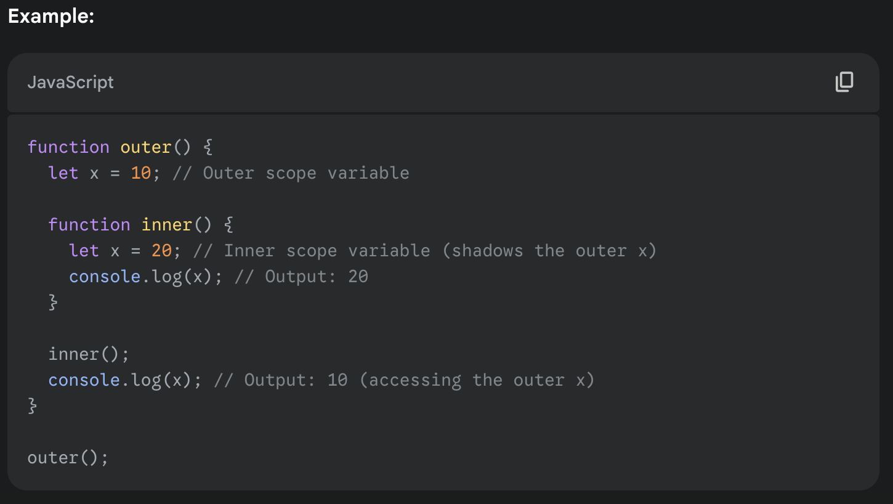

## Scope relation to a Function Execution context and a Function

Scope is created as soon as Function is declared but the Function Execution Context is created when the Function is invoked.
Scope chain is created when the Function Execution Context is in the creation phase i.e. when the Function is invoked.

1. Scope Determines Variable Accessibility in FEC:
   The function's scope (local and outer) defines which variables are visible when the function is invoked and the FEC is created.
2. Scope Chain is Built from Scope in FEC:
   During the creation phase of an FEC, a scope chain is built:

   - The current function's local variables are at the top of the chain.
   - The function’s outer scopes are added to the chain in the order of their nesting.

3. Dynamic Execution, Static Scope:

   - The scope is static (defined lexically when the function is declared).
   - The execution context is dynamic, as it is created every time the function is invoked.

4. Scope and Function

   - A function's scope is determined when the function is declared, not when it is executed. This is a result of lexical scoping in JavaScript.
   - Scope defines the set of variables (local and outer) that the function can access when it runs.
     When outerFunction is declared:
   - It "remembers" the global scope, as it is declared in the global context.
   - When innerFunction is declared: It "remembers" both the scope of outerFunction and the global scope.
   - The scope of a function is the region where it can access variables. This is fixed when the function is defined and does not change with each invocation.

5. Scope and Function Execution Context (FEC)

   - A Function Execution Context is created every time the function is invoked.
   - During the creation of the FEC, the function's scope determines which variables are available to the function during execution.
   - The Scope Chain is constructed inside the FEC to resolve variables - First, the function's local scope is checked. - Then, outer scopes (captured during function declaration) are checked in the order of their nesting. - Finally, the global scope is checked.

6. 

## Lexical (structural) Scoping

A function's scope is determined when the function is declared, not when it is executed. This is a result of lexical scoping in JavaScript. and this The scope is static (defined lexically when the function is declared). Lexically, this Lexically word and Lexical Scope is confusing me a lot

Think of it This Way:

- Lexical = Where it is written in the code.
- A function’s scope is baked in at the time of declaration, not at the time of execution.

The term lexical comes from the word "lexicon," which means dictionary or words and structure. In programming, lexical refers to how things are arranged in code, as it is written—in other words, based on its physical placement in the code.

Lexical Scoping means that the scope of a variable (where it can be accessed) is determined by where it is declared in the source code, not by where it is called or invoked.
This means:

- When a function is created, it "remembers" the environment in which it was declared.
- It will use this "remembered" environment (its lexical scope) whenever it is executed, no matter where it is called.

## Why is it Called Lexical Scoping?

It’s called lexical because the scope of variables is determined at the time of writing the code, based on the position of functions and blocks in the source code.

## Lexical vs Dynamic Scoping

**Lexical Scoping (JavaScript)**:

- A function’s scope is determined by its location in the source code.
- The scope is fixed when the function is defined and does not change based on where it is called.

**Dynamic Scoping (Other Languages)**:

- A function’s scope is determined by the call stack at runtime.
- The scope depends on where the function is called and what the current execution context is.

## Why is Lexical Scoping Important?

Lexical scoping is what allows closures to work. Closures "remember" the environment where they were created, thanks to lexical scoping.

## Closures

Lexical scoping allows inner functions to access variables from their outer environments.

## Shadowing

- Shadowing is a concept in programming where a variable declared in a more local scope (e.g., inside a function or block) has the same name as a variable in an outer scope, effectively "hiding" or "shadowing" the outer variable within that local scope.

- When shadowing occurs, the inner variable takes precedence over the outer variable in its scope, making the outer variable inaccessible within that block or function.

- When a variable is declared with the same name in a more inner scope, it "shadows" the variable from an outer scope, meaning the outer variable is no longer directly accessible.

- Even if the variable is initialised in the outer scope, but re-declaration in the inner scope leads to shadowing, so the out variable is no longer accessiblein the inner scope anymore.
