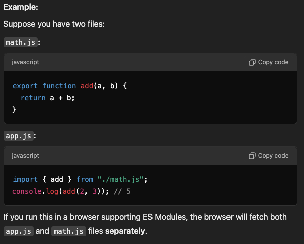
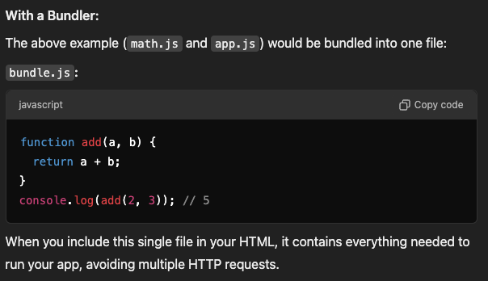
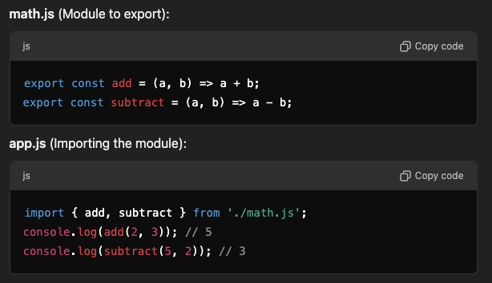
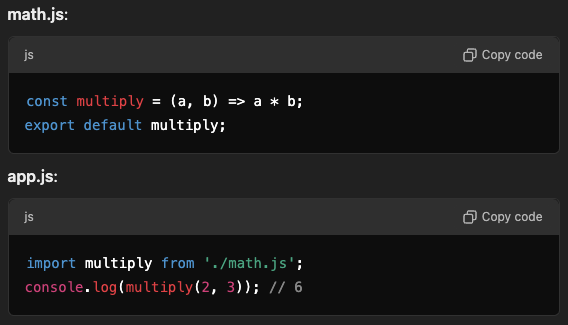
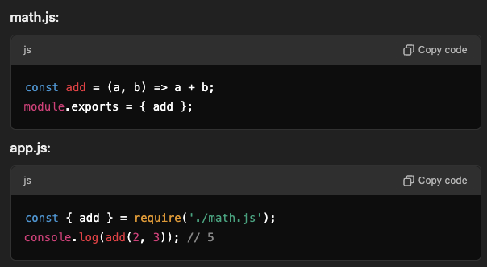
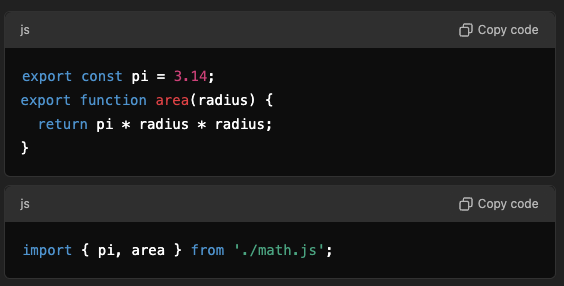
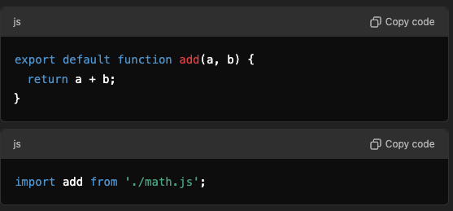
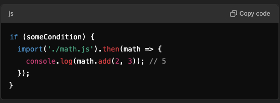
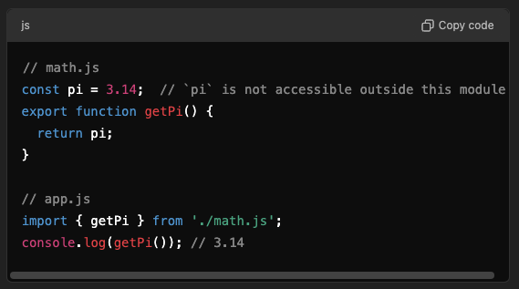

# Modules

- A JavaScript file is treated as a module only if it is loaded (or imported) in a context that declares it as a module — for example, using:

  ```js
  <script type="module" src="file.js"></script>
  ```

  or if it is imported by another module.

- A `.js` file becomes a module `not` by its file extension, but by how it is loaded or used.

- Even if the file itself doesn’t contain any import or export statements, it’s still treated as a module because of how it was loaded.
- Conversely, if you load a JS file without type="module", it is treated as a regular script, and using import or export inside it will cause a SyntaxError.

- You don’t even need a <script type="module"> tag for helper.js —
  as soon as it’s imported by another module, it is automatically treated as a module too.
- To create a modules we use `ES6 modules system` or `commonjs module system`.

**TL;DR — The Golden Rule**

- A JavaScript file is treated as a module if and only if:

  - It’s loaded via <script type="module">, or
  - It’s imported by another module.

- Otherwise, it’s a regular script, and import / export will throw errors.

| Condition                              | Module? | `import/export` Allowed? | Top-level `this` | Adds to `window`? |
| -------------------------------------- | ------- | ------------------------ | ---------------- | ----------------- |
| `<script src="file.js">`               | ❌ No   | ❌ SyntaxError           | `window`         | ✅ Yes            |
| `<script type="module" src="file.js">` | ✅ Yes  | ✅ Works                 | `undefined`      | ❌ No             |
| Imported by another module             | ✅ Yes  | ✅ Works                 | `undefined`      | ❌ No             |

- A module can be:

  1. A single file with one export (e.g., default export).
  2. A single file with multiple exports.
  3. Spread across multiple files using re-exports.

- A module system defines how code is organized, shared, and reused in smaller, modular pieces within a JavaScript application.

- The module can export variables, functions, objects, or classes, and other files can import and use them.

- Before the ES6 module system, JavaScript didn't have a built-in module system, and developers used patterns like the `Revealing Module Pattern` or third-party libraries (e.g., `CommonJS`, `AMD`) to handle modularity.

- With ES6 (ES2015), JavaScript introduced its native module system with the import and export keywords, which made working with modules more straightforward and standardized. In Es6 modules can be created by using `export` or `import` keyword in the js file.

- The module system (like ES6 import/export or CommonJS require) provides a way to organize and manage your code by splitting it into smaller, reusable modules. However, the module system itself does not combine these files into a single file or optimize them for deployment.

- In development, each module is fetched individually by the browser (if using native ES modules). In production, bundlers like Webpack combine them for efficiency.

- If no Bundler is used: The browser or Node.js executes the modules as separate files.
- If Bundler is used: The browser or Node.js executes a single js file after the bundler combines the modules into a single js file.

## Types of exports

1. Named Export: Multiple pieces of code can be exported using their names.
2. Default Export: Only one piece of code can be exported as the default.

## Work Flow in Module System without Bundler

- Modules itself doesn't get combined into one or few files. Each file is executed separately.
- The browser or Node.js executes the modules as separate files.
- Each file is fetched or read individually when needed, which can lead to performance issues (e.g., multiple network requests) if you have many small files.
  

## Work Flow in Module System with Bundler

- A bundler like Webpack or Rollup steps in to combine these multiple module js files into a single file (or a few optimized ones). This:
  - Reduces the number of network requests.
  - Optimizes code by removing unused exports (tree-shaking).
  - Ensures compatibility by transpiling modern code for older browsers.
  - in the example above 

## Key Features of Modules

- Modularize code for maintainability and reusability.
- Enable dependency management within applications.
- The module system itself does not bundle or optimize files.
- The module system (like ES6 import/export or CommonJS require) provides a way to organize and manage your code by splitting it into smaller, reusable modules. However, the module system itself does not combine these files into a single file or optimize them for deployment. For that third party libraries like webpack, vite, or rollups are used which are called bundler

## Why Use Modules

1. `Encapsulation`: By using modules, you can keep your code organized, ensuring that related logic is grouped together and not exposed unnecessarily.
2. `Reusability`: Modules make it easy to reuse code in multiple parts of your application, reducing redundancy.
3. `Maintainability`: With smaller, focused modules, your codebase becomes easier to maintain and scale over time.
4. `Separation of Concerns`: By splitting functionality into separate modules, you ensure that each module has a single responsibility.

## Module Loaders

1. `What They Are`:
   Module loaders are runtime systems that dynamically load JavaScript modules into your application. They parse, resolve, and execute module dependencies in real time, allowing developers to write modular and reusable code.

2. `How They Work`:
   They identify dependencies (e.g., import or require statements).
   Fetch the required modules, resolve dependencies, and execute them in the correct order.

3. `Examples`:
   Native Module Loader: Browsers natively support ES Modules with the <script type="module"> tag.
   Third-Party Loaders: RequireJS (AMD), SystemJS (universal module loader).

## Bundlers

1. `What They Are`: Bundlers are build-time tools that combine multiple modules into a single or a few files (bundles) for efficient delivery to the client. They pre-process and optimize the code, unlike module loaders, which work at runtime.

2. `How They Work`:

   - Dependency Graph: Bundlers analyze your codebase and construct a graph of all modules and their dependencies.
   - Bundling: They compile all modules into a single file or multiple optimized bundles.
   - Optimizations: Bundlers perform tasks like tree-shaking (removing unused code), minification (reducing file size), and code-splitting (loading only the code needed for specific pages).

3. `Examples`:
   1. Webpack: Most popular, highly configurable.
   2. Rollup: Best for libraries; focuses on ES modules and tree-shaking.
   3. Parcel: Zero-config, fast builds.

## Types of Module Systems

1. **ES6 (ECMAScript 2015) Modules (ESM)**

   1. **Syntax**: The ES6 module system uses the `import` and `export` keywords.

      - `export`: Used to export functions, objects, or variables from a module.
      - `import`: Used to import those exported values into another file.

        Eg: 

   2. **Named exports**: You can export multiple variables or functions from a module, like in the example above (add and subtract).

   3. **Default export**: You can export a single value from a module, like a function or class.

      Eg: 

2. **CommonJS (CJS) Modules**

   - This is the module system used by Node.js before ES6 modules were supported natively.
   - Syntax: CommonJS uses require to import and module.exports to export.
     Example: 
   - CommonJS modules are synchronous, and they work well in server-side environments like Node.js.

3. **AMD (Asynchronous Module Definition)**

   - AMD is an older module system, primarily used in the browser environment before ES6 was standardized. It's designed to load modules asynchronously.
   - Syntax: Uses `define` and `require` to manage dependencies and load modules.
   - AMD is less common now, as ES6 modules have become the standard.

## Key Concepts of Modules

1. Exports and Imports

   1. Named exports
      You can export multiple things from a module and import them using their names.
      
   2. Default export
      A module can export a single value or function as the default.
      

2. Dynamic Imports
   You can import modules dynamically using the import() function, which returns a promise and can be used in conditions or in parts of your code that need lazy-loading.
   

3. Module Scope
   Each module has its own scope. This means that the variables inside a module are not globally accessible unless explicitly exported.
   

4. Circular Dependencies
   Circular dependencies happen when two or more modules depend on each other. In the case of ES6 modules, JavaScript handles circular dependencies by returning an incomplete module at the time of the first import and filling it in later.

## How Modules Work in the Browser

- In modern browsers, ES6 modules are supported natively. To use them, you need to include your script tag with the type="module" attribute:

```JavaScript
<script type="module" src="app.js"></script>
```

- This ensures that the browser treats the file as a module and supports the import and export keywords.

- The browser then fetches and executes these modules, respecting their dependencies.

## How Modules Work in Node.js

- ES6 Modules are now supported in Node.js as well, but with some limitations depending on the version.

- To use ES6 modules in Node.js, you must either use .mjs file extensions or set "type": "module" in your package.json.

```JSON
{
  "type": "module"
}
```

- This enables you to use import and export in Node.js, as shown earlier.

## Module Bundling with Tools like Webpack

- In real-world projects, especially in front-end development, you'll often use bundlers like webpack, Parcel, or Rollup to bundle your modules.

- These tools help in optimizing and managing dependencies, handling different types of assets (CSS, images), and ensuring that your modules are bundled efficiently for production.

## Module Resolution

- When you import a module, JavaScript needs to figure out where that module is located. This process is called module resolution.

- Node.js resolves modules using a specific algorithm based on file paths, extensions (.js, .json, .node), and directories like node_modules.
- Webpack and other bundlers also have their own module resolution logic, which can be customized through configurations.
