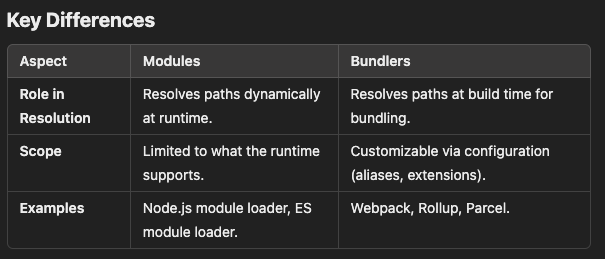

# Module Resolution

- Module resolution is the process by which a `module loader` or `bundler` determines the location and structure of a module to load its code.
- It involves finding the correct file or package corresponding to a module identifier (e.g., import { something } from './module') and ensuring that dependencies are correctly resolved.
- Module resolution is native to modules because it's required for them to function, but bundlers build on top of this process to enhance and optimize it for production use. You can think of module resolution as a shared foundational process that modules and bundlers both rely on—but bundlers take it further.

- **In Modules**

  1. Module resolution is intrinsic to the module system itself, whether it's `CommonJS`, `ES Modules`, or `AMD`. The module loader (e.g., Node.js or the browser) uses a specific algorithm to locate the files or packages that a module refers to.
     Examples:

     - In Node.js, the CommonJS module system follows the Node.js resolution algorithm to locate files or node_modules.
     - In the browser, ES Modules resolve paths exactly as specified (e.g., import './file.js'; or import 'lib';).

- **In Bundlers**

  1. Bundlers extend and optimize module resolution. While modules themselves focus on resolving paths dynamically or at runtime, bundlers perform resolution during the build process to create a single optimized bundle.
     Bundlers use the same principles as module systems but allow for additional configurations (like aliases, custom extensions, and tree-shaking).
     Examples:

     - Webpack, Rollup, and Parcel build a dependency graph by resolving modules and their imports, analyzing dependencies, and combining everything into bundles.
     - Bundlers often enhance resolution with custom logic, such as resolving aliases (@utils to src/utils) or adding support for custom extensions (.ts, .jsx, etc.).

## Module Resolution Working

1. `Module Identifier`:

   - A relative path (e.g., ./module.js or ../utils/helper).
   - A non-relative path (e.g., react, lodash).
   - An absolute path (e.g., /src/utils/helper.js).

2. `Resolution Steps`: The resolution process depends on whether the identifier is relative, non-relative, or absolute:

   - **Relative Paths (./module)**: Start from the importing file’s directory and look for the specified file.
   - **Non-Relative Paths (lodash)**: Search within node_modules or configured directories in the project.
   - **Absolute Paths (/src/utils)**: Resolve directly based on the absolute location (often used with custom configurations like Webpack's resolve).

## Module Resolution Strategies

There are two main resolution strategies in JavaScript:

1. **Node.js Module Resolution**

   1. Steps for Relative or Absolute Modules:

      - Check if the file exists (e.g., ./module.js).
      - If no file, look for an index.js file in a corresponding directory (e.g., ./module/index.js).

   2. Steps for Non-Relative Modules:

      - Look for the module in the nearest node_modules directory.
      - Traverse up the directory tree if the module is not found in the current folder's node_modules.

   3. Package Resolution:

      - If a package is imported (e.g., react), the algorithm checks for its package.json file.
      - It looks for the main field or, in the case of ES Modules, the exports field to determine the entry point.

2. **ES Module Resolution**
   Used in modern browsers and Node.js when using ES Modules.

   1. File Extensions:

      The extension is mandatory (.js, .mjs, .json) unless the environment supports implicit resolution.

   2. Relative and Absolute Imports:

      Must start with ./ or /.

   3. Bare Imports (e.g., lodash):

      Resolved from node_modules.

   4. Custom Configuration:

      Tools like Webpack, Rollup, and Vite allow customization with aliases, extensions, and fallback strategies.
