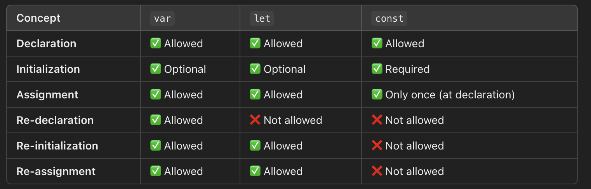

# In JavaScript, initializing and assigning a variable are related but distinct concepts

## 1. Declaring a Variable (declaration is done using certain specific keywords)

Before you can use a variable, you must declare it using `var`, `let`, or `const` keywords:

```ja
let x;
```

At this point, x is declared but has the value undefined.

## 2. Initializing a Variable (Initialization is done to a declared variable using assignment operator)

Initializing a variable means giving it an initial value when declaring it.

```js
let x = 10; // x is initialized with 10
```

Here, x is both declared and initialized in a single step.

## 3. Assigning a Variable

Assigning means giving a variable a value, either during initialization or at a later time.

```js
let y; // Declaration
y = 20; // Assignment
```

Here, y is declared first and assigned a value later.

## 4. Declaration and Initialization can be done simultaneously or separately

---

## 4. Re-declaration

Re-declaring a variable means declaring it again using var, let, or const.

- var allows re-declaration
- let and const do not

```js
var a = 10;
var a = 20; // ✅ Allowed with var

let b = 30;
// let b = 40; ❌ Error: Cannot re-declare let

const c = 50;
// const c = 60; ❌ Error: Cannot re-declare const
```

## 5. Re-initialization

Re-initialization means assigning a new value during declaration.

- var and let can be re-initialized
- const cannot be re-initialized

```js
var a = 10;
var a = 20; // ✅ Allowed with var

let b = 30;
// let b = 40; ❌ Error: Cannot re-declare let

const c = 50;
// const c = 60; ❌ Error: Cannot re-declare const
```

## 6. Re-assignment

Re-assignment means updating an existing variable.

var and let can be reassigned
const cannot be reassigned

```js
var g = 10;
g = 20; // ✅ Allowed

let h = 30;
h = 40; // ✅ Allowed

const i = 50;
i = 60; // ❌ Error: Cannot reassign const
```


