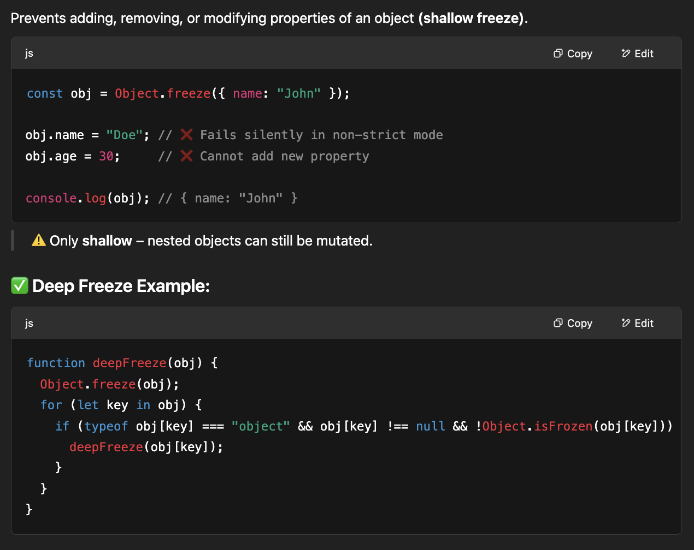
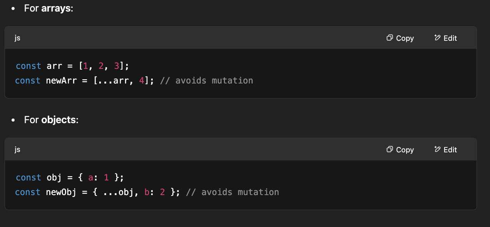
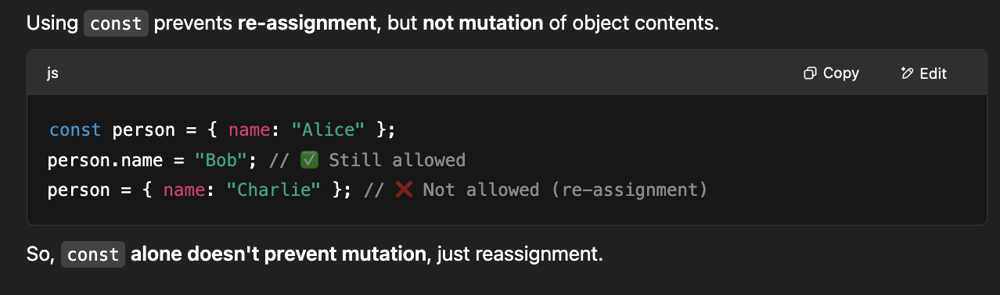

# Mutation vs Re-assignment

1. **Mutation**

   1. Changing the contents of the value itself (usually for objects or arrays) without changing the reference.
   2. Mutation changes the internals of the object the variable refers to, not the reference itself.
   3. Refers to changing the contents or state of an existing object or array without changing the reference to that object or array.
   4. Only applies to Reference Data Types i.e. `Arrays`, `Objects`, `Functions`, `Date`, `RegExp`
   5. Does Not apply to Primitive Data Types i.e. `Strings`, `Number`, `Boolean`, `null`, `undefined`, `BigInt`, `Symbol`
   6. Only objects and arrays are mutable in JavaScript. This means their internal properties or elements can be changed.
   7. `var`, `let` and `const` all there offers mutation

   ```js
   let a = [1, 2, 3];
   a.push(4); // mutation: The variable a still points to the same array, but that array's contents have changed.
   ```

2. **Re-assignment**

   1. Refers to assigning a new value or reference to a variable
   2. Re-assignment changes the reference a variable holds.
   3. Applies to both primitives and non-primitives
   4. `var` and `let` offers re-assignment
   5. `const` does not offer re-assignment

   ```js
   let a = [1, 2, 3];
   a = [4, 5]; // re-assignment: The variable a now points to a completely new array.
   ```

## Ways to Mutate Objects and Arrays in JavaScript

1. **Direct Property Re-Assignment/Changing the property of the object**

   ```javascript
   let person = { name: "John", age: 30 };
   person.age = 35;
   ```

2. **Adding New Properties:**

   ```javascript
   let person = { name: "John", age: 30 };
   person.gender = "Male";
   ```

3. **Deleting Properties:**

   ```javascript
   let person = { name: "John", age: 30 };
   delete person.age;
   ```

4. **Changing Object Reference:**

   ```javascript
   let person = { name: "John", age: 30 };
   let anotherPerson = person;
   anotherPerson.age = 35;
   ```

5. **Using Methods that Mutate:**

   ```javascript
   let arr = [1, 2, 3];
   arr.push(4); // Mutates the original array by adding a new element
   ```

6. **Modifying Nested Objects:**

   ```javascript
   let person = { name: "John", address: { city: "New York", country: "USA" } };
   person.address.city = "Los Angeles";
   ```

## Ways to prevent Mutation in Objects and Arrays in JavaScript

1. **Object.freeze()**
   Only shallow – nested objects can still be mutated. We can iterate over properties for deep freezing.
   

2. Use Immutable Libraries: Immer, Immutable.js
3. Use Shallow Copies to Avoid Mutating Originals
   
4. We `can't` use const to prevent mutations
   
