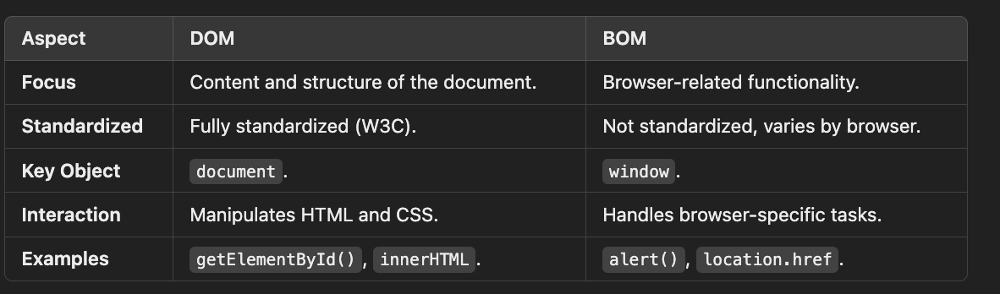

# DOM

- The DOM is focused on the document's content, structure, and style, enabling dynamic updates to the webpage.

- The BOM includes the DOM as part of its hierarchy:
  The document object (DOM) is a child of the window object (BOM).
  

## DOM vs BOM

### **1. Definition**

- **DOM (Document Object Model)**:

  - The DOM is a programming interface for web documents.
  - It represents the structure of an HTML or XML document as a tree of objects.
  - Allows JavaScript to interact with and manipulate the content, structure, and styles of the document.

- **BOM (Browser Object Model)**:
  - The BOM is a programming interface for the browser itself.
  - It represents the browser window and provides methods and properties to interact with the browser (e.g., navigation, screen, and history).
  - It is not standardized like the DOM but widely implemented in browsers.

---

### **2. Purpose**

- **DOM**:

  - Manipulate and control the document's content, structure, and appearance.
  - Interact with elements, attributes, and text nodes.

- **BOM**:
  - Handle browser-specific functions such as:
    - Navigating to URLs.
    - Controlling browser history.
    - Managing browser windows and alerts.

---

### **3. Components**

#### DOM Components

- `document` object.
- Nodes, elements, attributes, and text.
- Examples:
  - `document.getElementById()`
  - `document.querySelector()`
  - `innerHTML`, `style`, etc.

#### BOM Components

- `window` object (global object in the browser).
- Properties like:
  - `navigator` – Information about the browser.
  - `location` – Current URL details.
  - `history` – Browser history.
  - `screen` – Information about the user's screen.
  - `alert()`, `confirm()`, `setTimeout()`.
