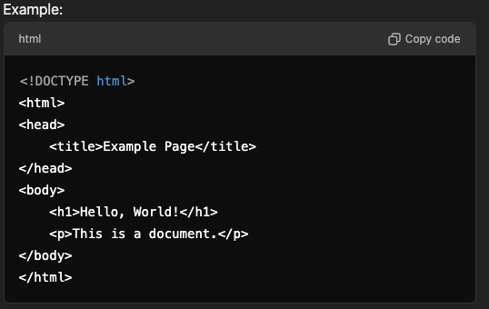
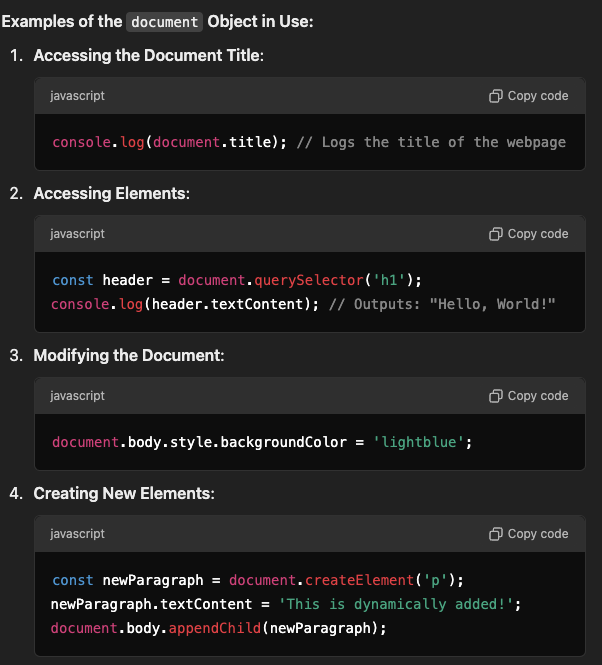

# Document

- In the context of the DOM, the Document `refers to the HTML or XML` document that is loaded in the browser.
- This document is the webpage you see when you open a site, which contains elements like text, images, links, and other resources.
- The document is the source of content that JavaScript can interact with.
- Document is the structural representation of a webpage that browsers interpret and render to the user.

## Breakdown of "Document"

1. HTML Document

   - The most common type of document.
   - When you open a webpage in a browser, the HTML file is parsed and converted into the DOM.
     

2. XML Document

   - The DOM can also represent XML documents.
   - Useful for applications that exchange data using XML.

## The document Object in JavaScript

- The document object is a global object in JavaScript that represents the DOM of the webpage.
- It provides methods and properties for interacting with the webpage.
  

## Summary

1. `Document`: It is the webpage (HTML or XML) loaded in the browser.
2. `DOM Representation`: The browser creates a tree structure (DOM) from the document, allowing JavaScript to interact with and modify the page.
3. `document Object`: A global JavaScript object that provides an interface to manipulate the DOM.

## HTML Document

- They are hierarchical and can be represented as a tree, that's why it's a document in the context of web development
- HTML is a type of document that is commonly used on the web
- HTML document is a structured text file that defines the content, structure, and presentation of a webpage using HTML (HyperText Markup Language)
- When a browser loads an HTML file, it parses the content and creates a Document Object Model (DOM), which is a representation of that HTML document in memory. This allows JavaScript to interact with the webpage.
- The file containing HTML code is called an HTML document.
- Saved with the .html or .htm extension.

## CSS is also a document?

In a technical sense, CSS (Cascading Style Sheets) files are not considered "documents" in the same way as HTML or XML files. Instead, CSS files are style resources or style sheets that define how elements in a document (like an HTML document) should be visually presented.

However, if we broaden the definition of "document" to mean any structured file, you could loosely describe a CSS file as a "document of styles."

While CSS files are structured text files, they lack the hierarchical, tree-like structure that is typical of HTML or XML documents. They are better classified as style resources or stylesheets rather than "documents."

However, if you treat the term "document" generically as "a file containing structured data," you might loosely refer to a CSS file as a document of style rules.

## Other File Types

Other file types, such as CSS, JSON, and JavaScript, are generally not considered "documents" in the same way because they serve different purposes:

1. CSS (Cascading Style Sheets):
   - Purpose: Defines the visual style of HTML elements.
   - Not a document: It is a "stylesheet" applied to a document, but it is not rendered as a standalone resource.
2. JavaScript:
   - Purpose: Adds interactivity and dynamic behavior to webpages.
   - Not a document: It’s a programming script that interacts with the document (DOM) but isn't treated as one.
3. JSON (JavaScript Object Notation):
   - Purpose: A lightweight data format used for exchanging structured information.
   - Can be considered a "data document", but it does not represent a visual or interactive document.
4. Markdown (.md):
   - Purpose: A lightweight markup language for formatting text.
   - Not a web document: It is converted to HTML for web rendering.

## Why is HTML called a "Document"

1. **Definition of a Document**: A document, in general, is a file that contains structured information. HTML provides a standardized way to define the structure of a webpage using elements like headings, paragraphs, links, images, and more.

2. **HTML is a Markup Language**: HTML uses tags (e.g., <html>, <body>, <h1>) to "mark up" content, organizing it into a document format that browsers can render visually.

3. **HTML and the Document Object Model (DOM)**: When the browser loads an HTML file, it becomes the document represented in the DOM. The DOM lets JavaScript access and modify the content, structure, and styles of the HTML.

## "Document" in JavaScript

1. Refers to the in-memory representation (DOM) of the loaded HTML file.

## Types of Documents

1. `HTML Document`: Used for webpages.
2. `XML Document`: Used for data representation and exchange.

---

## JavaScript cannot directly interact with the raw HTML document itself. Instead, the browser first parses the HTML document into the Document Object Model (DOM), and then JavaScript interacts with the DOM, which is the in-memory representation of the HTML structure.
