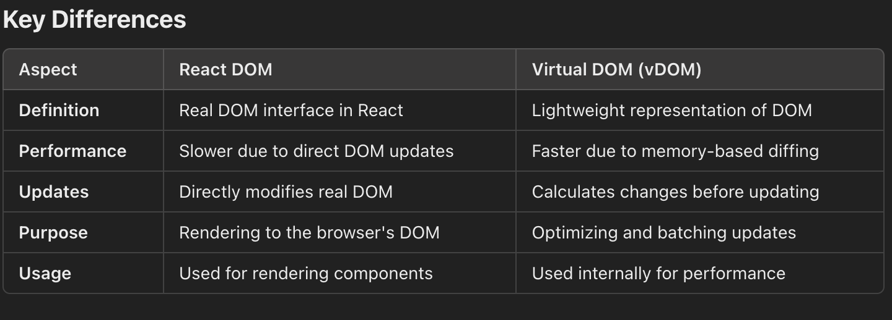

# ReactDOM

- Implements the updates in the browser’s real DOM based on the reconciliation results.
- The React DOM is the actual interface between React and the browser's DOM. It is responsible for rendering React components into the browser's real DOM.
- It updates the real DOM based on changes in the React application.
- React creates a `vDOM` when you define components.
- When `state` or `props` change, React updates the `vDOM`, computes the differences, and identifies the minimal changes required.
- React DOM takes these updates and applies them to the real DOM.
  -The React DOM is not directly involved in the reconciliation process but becomes critical afterward, as it executes the updates calculated during reconciliation by interacting with the real DOM. This separation ensures React applications are highly performant and optimized.

## ReactDOM vs vDOM

