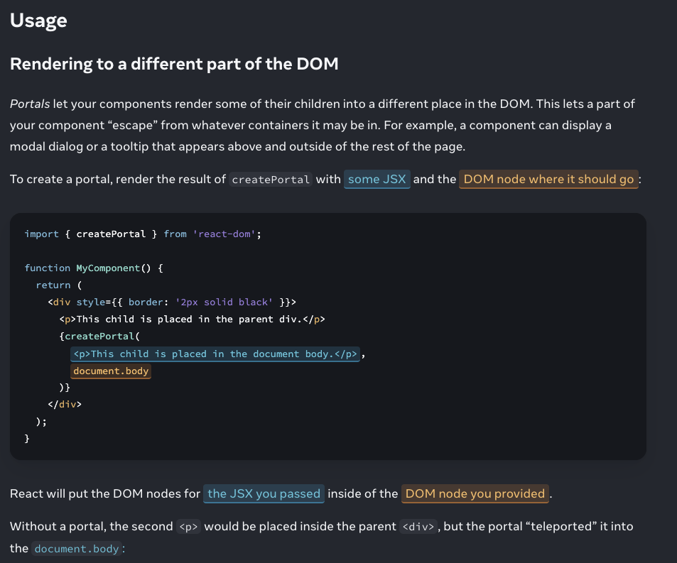

# Portals in React

In React, Portals provide a way to render children into a DOM node that exists outside the DOM hierarchy of the parent component. This is particularly useful when you need to render a child element visually and logically outside its parent's structure, such as for modals, tooltips, or dropdowns.

## React Portals Working Process

- A portal is created using the `createPortal(children, domNode, key?)` method. This method takes two arguments:

  1. `Child`: The React element to render.
  2. `Container`: The DOM element where the child should be rendered.

