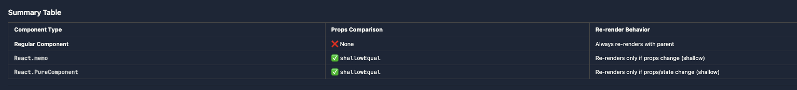
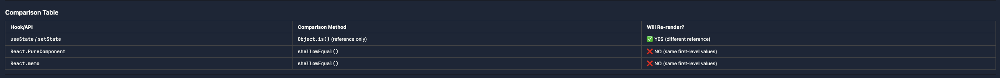
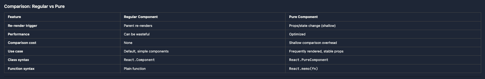

# When Does a React Component Re-render

In React, `shallow comparison` is explicitly used only in `React.memo` (for functional components) and `React.PureComponent` (for class components) to compare props (and state in case of PureComponent). Everywhere else — such as `state updates` or dependency checks in hooks like `useEffect, useMemo, useCallback` etc — React performs a `reference equality check` using the `Object.is()` method, not a shallow or deep comparison.

React re-renders when a value in state or dependency array receives a new reference (according to Object.is).

React components re-renders by default

- when the state reference changes.
- parent component renders then regular child component always re-renders
- props (React has different behaviors for props depending on whether you're using regular components or optimized components)

  1. `Regular Function/Class Components` → No Comparison (Always Re-render): Regular components don't compare props at all - they re-render whenever the parent re-renders.

     ```js
     // Regular function component
     function Child({ name, email }) {
       console.log("Child rendered");
       return (
         <div>
           {name} - {email}
         </div>
       );
     }

     function Parent() {
       const [count, setCount] = useState(0);

       return (
         <>
           <button onClick={() => setCount(count + 1)}>Count: {count}</button>
           <Child name="john" email="gg@gmail.com" />
         </>
       );
     }

     // Click button:
     // Parent re-renders → Child ALWAYS re-renders
     // Props are NOT compared at all!
     ```

  2. `React.memo (Function Components)` → Uses shallowEqual: Wrapped in React.memo, the component uses shallowEqual to compare props.

     ```js
     // Memoized component
     const Child = React.memo(({ name, email }) => {
       console.log("Child rendered");
       return (
         <div>
           {name} - {email}
         </div>
       );
     });

     function Parent() {
       const [count, setCount] = useState(0);

       return (
         <>
           <button onClick={() => setCount(count + 1)}>Count: {count}</button>
           <Child name="john" email="gg@gmail.com" />
         </>
       );
     }

     // Click button:
     // Parent re-renders
     // React.memo does: shallowEqual(oldProps, newProps)
     // oldProps: { name: "john", email: "gg@gmail.com" }
     // newProps: { name: "john", email: "gg@gmail.com" }
     // Both are primitives and equal → Child WON'T re-render ✅
     ```

     1. `React.PureComponent (Class Components)` → Uses shallowEqual: PureComponent uses shallowEqual for both props and state.

     ```js
     // PureComponent class component
     class Child extends React.PureComponent {
       render() {
         console.log("Child rendered");
         return (
           <div>
             {this.props.name} - {this.props.email}
           </div>
         );
       }
     }

     function Parent() {
       const [count, setCount] = useState(0);

       return (
         <>
           <button onClick={() => setCount(count + 1)}>Count: {count}</button>
           <Child name="john" email="gg@gmail.com" />
         </>
       );
     }

     // Click button:
     // Parent re-renders
     // React.PureComponent does: shallowEqual(oldProps, newProps) && shallowEqual(oldState, newState)
     // oldProps: { name: "john", email: "gg@gmail.com" }
     // newProps: { name: "john", email: "gg@gmail.com" }
     // Both are primitives and equal → Child WON'T re-render ✅
     ```

     Summary Table

     

     ### Example: Props with Nested Objects

     ```js
     const Child = React.memo(({ user }) => {
       console.log("Child rendered");
       return (
         <div>
           {user.name} - {user.email}
         </div>
       );
     });

     function Parent() {
       const [count, setCount] = useState(0);

       return (
         <>
           <button onClick={() => setCount(count + 1)}>Count: {count}</button>
           <Child user={{ name: "john", email: "gg@gmail.com" }} />
         </>
       );
     }

     // Click button:
     // Parent re-renders
     // New object created: { name: "john", email: "gg@gmail.com" }
     // React.memo does: shallowEqual(oldProps, newProps)
     // oldProps.user !== newProps.user (different references)
     // Child WILL re-render ❌ (even though content is same!)
     ```

by default, when a parent component re-renders, all of its child components also re-render.

This happens even if the child’s props haven’t changed, because React re-renders the entire subtree starting from the parent that changed.

## When State changes: No Shallow Comparison, only reference comparison between previous and next state

- React does not do shallow or deep comparison of state values — just a simple reference check using `Object.is()`.
- In React, state is compared by reference — not shallow compared.
- When you update state using useState or useReducer: React only checks if the new state is the same reference as the previous one using `Object.is()`.

  - If the reference is different, React re-renders.
  - If the reference is the same, React skips the re-render — even if the internal values have changed (mutated).

Shallow comparison would mean comparing each top-level key like this:

```js
user.name === newUser.name; // shallow comparison
```

React does not do this internally for state updates. It simply checks:

```js
Object.is(prevState, nextState);
```

| Type                                     | Used in React `useState` / `useReducer` |
| ---------------------------------------- | --------------------------------------- |
| **Reference comparison (`Object.is()`)** | ✅ Yes                                  |
| Shallow comparison                       | ❌ No                                   |
| Deep comparison                          | ❌ No                                   |

### Both useState and useReducer Use the Same Comparison

**Important:** `useState` and `useReducer` use **identical comparison logic** - both use `Object.is()` (reference equality) to compare state values.

```js
// useState
const [state, setState] = useState(initialValue);
// React checks: Object.is(prevState, newState)

// useReducer
const [state, dispatch] = useReducer(reducer, initialValue);
// React checks: Object.is(prevState, newState)
```

**Key Points:**

- Both hooks use `Object.is()` for comparison
- Both compare by reference for objects/arrays
- Both compare by value for primitives
- No difference in comparison behavior between the two

### Both useState and useSelector only reference comparison is used for re-rendering

React-Redux re-renders the component if the selected value's reference has changed.
To prevent unnecessary re-renders when selecting objects, React-Redux allows you to provide a custom comparison function, and it even ships with one:

### When Does a React Component Won't Re-render in case of state change

- A React component won't re-render if the reference of the previous state and current state is same.
- When we mutate the state the reference of the state remains same so the react component won't re-render.

### For primitive state value

React compares the previous state with new state by compare by value. If it is changed the react component re-renders.

### For non-primitive state value

React compares the previous state with new state by compare by reference. If the state has new reference the component re-renders.

React's useState only triggers re-render if the new state has a different reference than the old one.

---

## A React function component re-renders **after the first render** when any of the following conditions are met

### 1. **State Changes (via `useState`)**

```js
const [count, setCount] = useState(0);

// triggers re-render
setCount((prev) => prev + 1);
```

- React compares the old and new state values (reference comparison, NOT shallow).
- If the value changed → it re-renders the component.

---

### 2. **Props Change**

By default child component always re-renders when parent re-renders, it doesn't care for the props to change, unless the child component is wrapped with React.memo and in that case next prop is compared with previous prop using shallow comparison, if it is shallow different then the child component wrapped with react.memo re-renders.

Props comparison only happens with:

- React.memo(): Does shallow comparison of props
- useMemo() / useCallback(): Prevents creating new references

useMemo/useCallback compare dependencies using Object.is() (reference equality)

```js
<MyComponent title="Nishant" />
```

- If `title` changes (e.g., from `"Nishant"` to `"Nish"`), React re-renders `MyComponent`.
- React uses shallow comparison of prop values.

---

### 3. **Context Value Changes (`useContext`)**

```js
const theme = useContext(ThemeContext);
```

- Re-renders when the value passed by `<ThemeContext.Provider>` changes.
- React uses **`Object.is()`** (reference equality) to compare context values.
- For primitive values: compared by value
- For object/array values: compared by reference (not by contents)
- **Important:** Always memoize context values that contain objects/arrays to prevent unnecessary re-renders

---

### 4. **Parent Component Re-renders**

- If a parent re-renders (due to its own state/props changes), the child re-renders **by default**.
- Even if the child component has no props, it will still re-render when its parent re-renders, by default.
- This can be prevented using `React.memo()` or `shouldComponentUpdate()` (in class components).

---

### 5. **Force Update (not recommended)**

```js
const [, forceUpdate] = useReducer((x) => x + 1, 0);
forceUpdate(); // Triggers a re-render manually
```

---

### 6. **Redux Store Changes (with `useSelector`)**

```js
const value = useSelector((state) => state.user.name);
```

- Component re-renders **only** if `state.user.name` value changes.
- `useSelector` uses reference equality (`Object.is()`) for comparison, not shallow equality.

---

### ❌ React Will NOT Re-render If:

- You call `setState` with the **same value** as current.
  ```js
  setCount(1); // if count is already 1 → no re-render
  ```
- Props did not change (same value or reference).
- Context value remains the same.
- Redux state returns the same reference for selected value.
- Parent re-renders, but child is wrapped in `React.memo()` and props haven't changed.

---

### ✅ Summary Table

| Trigger                             | Causes Re-render? |
| ----------------------------------- | ----------------- |
| `setState` with new value           | ✅ Yes            |
| `setState` with same value          | ❌ No             |
| Props changed (new value/reference) | ✅ Yes            |
| Parent component re-rendered        | ✅ Usually        |
| Context value changed               | ✅ Yes            |
| Redux `useSelector` value changed   | ✅ Yes            |
| Redux state unchanged (same ref)    | ❌ No             |

---

### Lets assuem a component and we have initial state, objInitial = {name: "john", email: "gg@gmail.com"}

now I run setState({name: "john", email: "gg@gmail.com"})
this componet will re-render or not ?let me think, while setState we passing an object with same first level propertiers but the reference is different, so here it is shalllow equal according to react shallow eauality algorithyrm so this compoent won't re-render: this statemt true of false?

❌ FALSE - The component WILL re-render!
Here's why your reasoning is incorrect:
The Critical Mistake in Your Logic

- React does NOT use shallowEqual for setState comparisons!
- React only uses shallowEqual for:
- React.PureComponent (props and state comparison)
- React.memo (props comparison only)
- For regular useState/setState, React uses simple reference equality (Object.is()).

What Actually Happens

```js
function MyComponent() {
  const objInitial = { name: "john", email: "gg@gmail.com" };
  const [state, setState] = useState(objInitial);

  // Later you call:
  setState({ name: "john", email: "gg@gmail.com" });

  // React's check:
  const oldState = { name: "john", email: "gg@gmail.com" }; // Previous state
  const newState = { name: "john", email: "gg@gmail.com" }; // New state

  // React checks: Object.is(oldState, newState)
  oldState === newState; // FALSE (different object references)

  // Result: Component WILL RE-RENDER ✅
}
```

React's setState Logic

```js
// Simplified React internal logic for useState:

function useState(initialValue) {
  const [state, internalSetState] = useStateInternal(initialValue);

  const setState = (newValue) => {
    // React's check:
    if (Object.is(state, newValue)) {
      // Same reference → Skip re-render
      return;
    }

    // Different reference → Schedule re-render
    internalSetState(newValue);
  };

  return [state, setState];
}

// Notice: NO shallowEqual check!
// Only Object.is() reference check!
```

When Would It NOT Re-render?

```js
function MyComponent() {
  const [state, setState] = useState({
    name: "john",
    email: "gg@gmail.com",
  });

  const handleClick = () => {
    // Passing the SAME object reference
    setState(state); // state === state → true
  };

  return <button onClick={handleClick}>Update</button>;
}

// Click button:
// No re-render! ✅ (Same reference)
```

Proof with Code

```js
function MyComponent() {
  const [state, setState] = useState({
    name: "john",
    email: "gg@gmail.com",
  });

  console.log("Render count:", ++renderCount);

  const handleClick = () => {
    // Passing NEW object with same values
    setState({ name: "john", email: "gg@gmail.com" });
  };

  return <button onClick={handleClick}>Update</button>;
}

// Click button:
// Output: "Render count: 2" ✅ (Component re-rendered!)
```

Comparison Table



Summary
Your statement:

> "setState with same first-level properties but different reference → shallow equal → won't re-render"
> Is FALSE because:
> ❌ setState doesn't use shallowEqual - it uses Object.is()
> ❌ Different reference → React sees as different → WILL re-render
> ✅ shallowEqual is only used by PureComponent and React.memo
> Correct statement:
> "setState with same first-level properties but different reference → different reference detected by Object.is() → WILL re-render"

---

## Final Answer

1. `For props:`

   - Regular components: No comparison (always re-render)
   - React.memo / PureComponent: shallowEqual (compares first-level values)

2. `For state:`

   - useState / setState: Object.is() (reference equality only)
   - This is why you need useMemo / useCallback to prevent unnecessary re-renders when passing objects/functions as props to memoized components!

### The react.memo/ react.pure component shallow compare confusion

But below aren't the first level properties same and only object reference difference and hence shallowEqual props object thus for child components wrapped in react.memo or react.pure component it shouldn't re-render?

```js
const Child = React.memo(({ user }) => {
  console.log("Child rendered");
  return (
    <div>
      {user.name} - {user.email}
    </div>
  );
});

function Parent() {
  const [count, setCount] = useState(0);

  return (
    <>
      <button onClick={() => setCount(count + 1)}>Count: {count}</button>
      <Child user={{ name: "john", email: "gg@gmail.com" }} />
    </>
  );
}

// Click button:
// Parent re-renders
// New object created: { name: "john", email: "gg@gmail.com" }
// React.memo does: shallowEqual(oldProps, newProps)
// oldProps.user !== newProps.user (different references)
// Child WILL re-render ❌ (even though content is same!)
```

Answer:

Ah! Great catch - you're confusing which object React compares!
React.memo compares the `PROPS` object, not the user object!
Let me break this down:

What React.memo Actually Compares

```js
// Render 1:
const oldProps = {
  user: { name: "john", email: "gg@gmail.com" }, // Object A
};

// Render 2 (after parent re-renders):
const newProps = {
  user: { name: "john", email: "gg@gmail.com" }, // Object B (NEW!)
};

// React.memo does:
shallowEqual(oldProps, newProps);

// This checks the FIRST-LEVEL properties of the PROPS object:
// 1. Do they have the same keys?
//    oldProps has: ['user']
//    newProps has: ['user']
//    ✅ YES

// 2. Are the first-level values equal?
//    Object.is(oldProps.user, newProps.user)
//    Object.is(ObjectA, ObjectB)
//    ❌ FALSE (different references!)

// Result: shallowEqual returns FALSE
// Component WILL RE-RENDER ✅
```

Visual Breakdown

```js
<Child user={{ name: "john", email: "gg@gmail.com" }} />

// The props object is:
props = {
  user: <reference to object>
}

// React compares THIS level (props):
// - props.user (first-level property)

// React does NOT compare inside user object:
// - user.name (second-level, not checked by shallowEqual)
// - user.email (second-level, not checked by shallowEqual)
```

The Hierarchy

```js
Props Object (THIS is what React.memo compares)
└── user (first-level property) ← Compared by reference
    ├── name (second-level) ← NOT compared
    └── email (second-level) ← NOT compared

```

Why Your Reasoning is Wrong
You said:

> "First level properties same, only object reference different"
> But you're looking at the wrong level!

```js
// ❌ You're thinking React compares THIS:
user object: { name: "john", email: "gg@gmail.com" }
// First level: name, email (primitives - would be equal!)

// ✅ React actually compares THIS:
props object: { user: <reference> }
// First level: user (object reference - different!)

```

The Key Insight
React.memo's shallowEqual checks the props object, not nested objects inside props!

Your confusion: You were thinking React checks user.name and user.email (2nd level).
Reality: React only checks props.user (1st level), and it's a different object reference each time.
Result: Component WILL re-render because oldProps.user !== newProps.user.

---

### What is pure Component in react

A Pure Component is a React component that only re-renders when its props or state change (detected via shallow comparison). It's an optimization technique to avoid unnecessary re-renders.

The Concept: "Pure" Function
In programming, a pure function:

- Returns the same output for the same input
- Has no side effects

```js
// Pure function
function add(a, b) {
  return a + b;
}

add(2, 3); // Always returns 5
add(2, 3); // Always returns 5 (predictable)
```

A Pure Component applies this concept:

- Same props + same state = same output (same UI)
- If props and state haven't changed, no need to re-render

Two Types of Pure Components in React

1. React.PureComponent (Class Components)
   A class component that automatically implements shallow comparison for props and state.

   ```js
   class MyComponent extends React.PureComponent {
     render() {
       console.log("Rendered");
       return <div>{this.props.name}</div>;
     }
   }

   function Parent() {
     const [count, setCount] = useState(0);

     return (
       <>
         <button onClick={() => setCount(count + 1)}>Count: {count}</button>
         <MyComponent name="john" />
       </>
     );
   }

   // Click button:
   // Parent re-renders, but MyComponent doesn't re-render
   // Because props.name hasn't changed
   ```

2. React.memo (Functional Components)
   A higher-order component that wraps functional components to make them "pure".

   ```js
   const MyComponent = React.memo(({ name }) => {
     console.log("Rendered");
     return <div>{name}</div>;
   });

   function Parent() {
     const [count, setCount] = useState(0);

     return (
       <>
         <button onClick={() => setCount(count + 1)}>Count: {count}</button>
         <MyComponent name="john" />
       </>
     );
   }

   // Click button:
   // Parent re-renders, but MyComponent doesn't re-render
   // Because prop 'name' hasn't changed
   ```

How Pure Components Work

Regular Component (Always Re-renders):

```js
class RegularComponent extends React.Component {
  render() {
    console.log("Regular: Rendered");
    return <div>{this.props.name}</div>;
  }
}

function Parent() {
  const [count, setCount] = useState(0);

  return (
    <>
      <button onClick={() => setCount(count + 1)}>Count: {count}</button>
      <RegularComponent name="john" />
    </>
  );
}

// Click button:
// Output: "Regular: Rendered" (every time)
// Re-renders even though props didn't change ❌
```

Pure Component (Smart Re-rendering):

```js
class PureComponentExample extends React.PureComponent {
  render() {
    console.log("Pure: Rendered");
    return <div>{this.props.name}</div>;
  }
}

function Parent() {
  const [count, setCount] = useState(0);

  return (
    <>
      <button onClick={() => setCount(count + 1)}>Count: {count}</button>
      <PureComponentExample name="john" />
    </>
  );
}

// Click button:
// No output (Pure component doesn't re-render) ✅
// Skips re-render because props.name hasn't changed
```

What Pure Components Check
Pure components use shallowEqual to compare:
For React.PureComponent:
✅ Props (shallow comparison)
✅ State (shallow comparison)
For React.memo:
✅ Props only (shallow comparison)

Detailed Example

```js
class PureChild extends React.PureComponent {
  render() {
    console.log("PureChild rendered");
    return (
      <div>
        Name: {this.props.name}
        Age: {this.props.age}
      </div>
    );
  }
}

function Parent() {
  const [count, setCount] = useState(0);
  const [name, setName] = useState("john");
  const [age, setAge] = useState(30);

  return (
    <>
      <button onClick={() => setCount(count + 1)}>Count: {count}</button>

      <button onClick={() => setName("jane")}>Change Name</button>

      <PureChild name={name} age={age} />
    </>
  );
}

// Click "Count":
// PureChild doesn't re-render ✅ (name and age unchanged)

// Click "Change Name":
// PureChild re-renders ✅ (name changed)
```

Behind the Scenes
What React.PureComponent Actually Does:

```js
class PureComponent extends React.Component {
  // Automatically implements this:
  shouldComponentUpdate(nextProps, nextState) {
    // Shallow comparison of props
    const propsEqual = shallowEqual(this.props, nextProps);

    // Shallow comparison of state
    const stateEqual = shallowEqual(this.state, nextState);

    // Only re-render if props OR state changed
    return !propsEqual || !stateEqual;
  }
}
```

What React.memo Actually Does:

```js
function memo(Component) {
  return function MemoizedComponent(props) {
    // Compare with previous props
    const prevProps = usePrevious(props);

    if (prevProps && shallowEqual(prevProps, props)) {
      // Props haven't changed, return cached result
      return cachedResult;
    }

    // Props changed, re-render
    const result = <Component {...props} />;
    cachedResult = result;
    return result;
  };
}
```

When to Use Pure Components

✅ Use Pure Components When:

- Component renders often with the same props
- Component is expensive to render
- Props are primitives or stable references
- You want to optimize performance

```js
// Good use case: List item that renders many times
const ListItem = React.memo(({ id, name, email }) => {
  return (
    <div>
      <h3>{name}</h3>
      <p>{email}</p>
    </div>
  );
});

function List({ items }) {
  return items.map((item) => <ListItem key={item.id} {...item} />);
}
```

❌ Don't Use Pure Components When:

- Props change frequently (no benefit)
- Props contain objects/arrays that change references often
- Component is very simple/fast to render
- The shallow comparison cost outweighs re-render cost

```js
// Bad use case: Props always change
const Timer = React.memo(({ timestamp }) => {
  return <div>{timestamp}</div>;
});

// timestamp changes every second, so memo is useless
setInterval(() => {
  <Timer timestamp={Date.now()} />;
}, 1000);
```

Common Pitfall: Nested Objects

```js
const PureChild = React.memo(({ user }) => {
  console.log("Rendered");
  return <div>{user.name}</div>;
});

function Parent() {
  const [count, setCount] = useState(0);

  return (
    <>
      <button onClick={() => setCount(count + 1)}>Count: {count}</button>
      <PureChild user={{ name: "john" }} /> {/* ❌ New object every time! */}
    </>
  );
}

// Click button:
// "Rendered" logged every time ❌
// Pure component re-renders because user object reference changes

// Fix with useMemo:
const user = useMemo(() => ({ name: "john" }), []);
<PureChild user={user} />; // ✅ Same reference
```

Comparison: Regular vs Pure



Real-World Example

```js
// Expensive component (heavy calculation or large UI)
const ExpensiveChart = React.memo(({ data, title }) => {
  console.log("Rendering chart...");

  // Expensive rendering logic
  const chartData = processData(data); // Heavy computation

  return (
    <div>
      <h2>{title}</h2>
      <canvas>{/* Render complex chart */}</canvas>
    </div>
  );
});

function Dashboard() {
  const [refreshCount, setRefreshCount] = useState(0);
  const [chartData] = useState([
    /* large dataset */
  ]);

  return (
    <>
      <button onClick={() => setRefreshCount((c) => c + 1)}>
        Refresh Dashboard ({refreshCount})
      </button>

      <ExpensiveChart
        data={chartData} // Stable reference
        title="Sales Data" // Same value
      />
    </>
  );
}

// Click "Refresh":
// Dashboard re-renders, but ExpensiveChart doesn't ✅
// Saves expensive chart re-render
```

Summary

Pure Component = Component that only re-renders when props/state actually change

**Two implementations:**

- React.PureComponent - For class components
- React.memo - For functional components

**How it works:**

- Uses shallow comparison (shallowEqual)
- Compares previous props/state with new props/state
- Skips re-render if equal

**When to use:**

- Frequently rendered components
- Expensive render logic
- Stable props (primitives or memoized objects)

Key insight: Pure components are a performance optimization, not a correctness feature. Your app should work without them, but they can make it faster!
